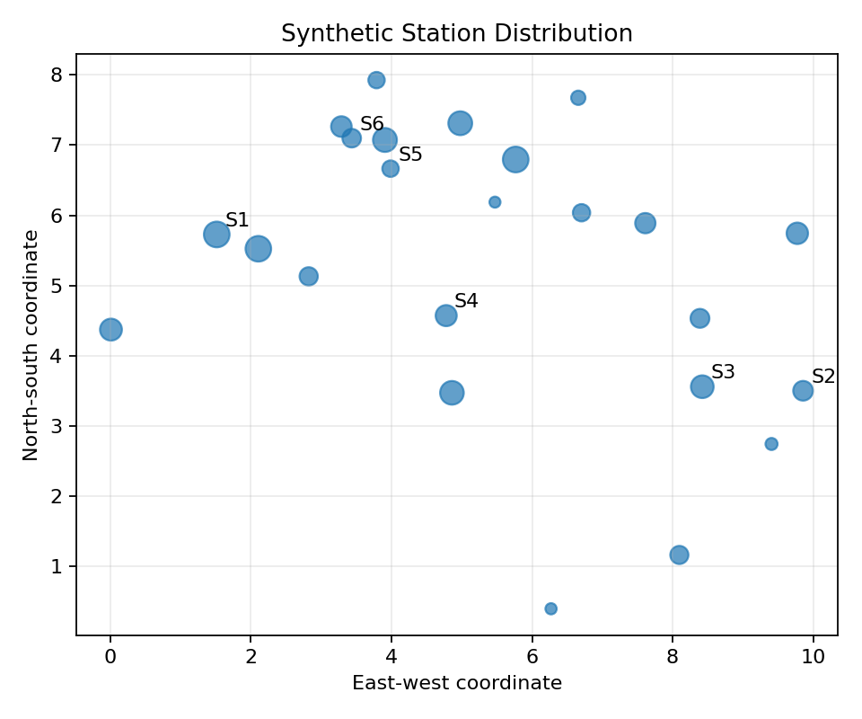

# 摘要

本文构造了一篇专门用于 NodePaper 端到端测试的虚构数学建模论文。测试数据不对应任何真实城市、学校或比赛队伍。我们首先利用 24 小时需求序列描述共享单车站点的潮汐变化，然后以调度成本与缺车惩罚的加权和作为目标函数，建立离散调度模型。模型使用变量 $y_{ij}$ 表示从站点 $i$ 向站点 $j$ 转移的车辆数，并通过容量约束和守恒约束保证方案可执行。测试结果显示，虚构方案能够降低总成本并改善缺车率。本文同时覆盖中文段落、英文缩写 API、数字 2026、行内公式、块级公式、图片、表格、脚注、代码块、文献引用以及跨章节交叉引用，用于验证 NodePaper 的完整构建链。

**关键词：** 共享单车；调度优化；时间序列；文档构建

# 问题重述 {#sec:problem}

某虚构城市包含若干共享单车站点。不同时间段的需求存在明显差异，需要根据预测需求安排车辆转移。本文只讨论用于排版测试的合成数据，不提供现实决策建议。

已有研究常使用时间序列与优化模型分析共享出行问题 [@wang2024bikesharing]。英文研究也给出了类似的预测与调度框架 [@smith2023forecast; @chen2021dispatch]。

# 模型假设

模型作出以下假设：

1. 各站点位置在研究周期内不发生变化；
2. 调度车辆容量固定；
3. 合成需求数据已经完成异常值处理；
4. 不考虑极端天气和临时道路封闭。

主要输入包括：

- 各站点初始车辆数；
- 分时需求预测；
- 站点间单位调度成本；
- 站点容量上限。

测试数据均为虚构。[^data]

[^data]: 本文中的城市、机构、数据、文献题名和数值仅用于 NodePaper 测试。

# 符号说明

| 符号 | 含义 | 单位 |
|---|---|---|
| $x_i$ | 站点 $i$ 的初始车辆数 | 辆 |
| $d_i$ | 站点 $i$ 的预测需求量 | 辆 |
| $c_{ij}$ | 从站点 $i$ 到站点 $j$ 的单位调度成本 | 元/辆 |
| $y_{ij}$ | 从站点 $i$ 调往站点 $j$ 的车辆数 | 辆 |

: 模型主要符号 {#tbl:symbols}

表 @tbl:symbols 给出了模型使用的主要变量。正文中的**调度成本**是优化目标之一，而*需求预测*作为输入条件。

# 数据与预处理 {#sec:data}

图 @fig:demand-trend 展示了虚构的 24 小时需求变化。图片由测试脚本生成，不涉及第三方版权。

{#fig:demand-trend width=85%}

站点的空间分布见图 @fig:station-map。图中点的大小仅用于制造不同尺寸的绘图元素。

{#fig:station-map width=70%}

总需求定义为：

$$
D = \sum_{i=1}^{n} d_i
$$

# 模型建立 {#sec:model}

根据第 @sec:problem 节的问题描述以及第 @sec:data 节的合成数据，定义从站点 $i$ 向站点 $j$ 的调度量为 $y_{ij}$。

目标函数如式 @eq:objective 所示：

$$
\min Z =
\sum_{i=1}^{n}\sum_{j=1}^{n} c_{ij}y_{ij}
+ \lambda \sum_{i=1}^{n} s_i
$$ {#eq:objective}

其中，$\lambda$ 为缺车惩罚系数，$s_i$ 为站点 $i$ 的缺车量。

车辆守恒约束为：

$$
x_i + \sum_{j=1}^{n} y_{ji}
- \sum_{j=1}^{n} y_{ij}
- d_i + s_i \ge 0
$$ {#eq:balance}

为了测试矩阵排版，定义一个简单状态转移矩阵：

$$
\mathbf{A} =
\begin{bmatrix}
1 & -1 \\
0 & 1
\end{bmatrix},
\qquad
\boldsymbol{x}_{t+1} = \mathbf{A}\boldsymbol{x}_t
$$

# 模型求解

本测试不执行代码，只验证代码块排版：

```python
def total_demand(values):
    # Sum synthetic demand values.
    return sum(values)
```

求解流程如下：

1. 读取合成需求；
2. 计算站点缺口；
3. 构造调度成本；
4. 求解离散优化模型；
5. 导出表格和图片。

模型设计参考了运筹学教材中的一般思想 [@li2022optimization]，并使用虚构报告作为数据描述示例 [@city2025report]。

# 结果分析

式 @eq:objective 和式 @eq:balance 共同确定了优化问题。表 @tbl:result 给出一组合成结果。

| 方案 | 总成本（元） | 缺车率 |
|---|---:|---:|
| 调度前 | 12500 | 18.2% |
| 调度后 | 8930 | 6.4% |

: 不同调度方案的结果对比 {#tbl:result}

从表 @tbl:result 可以看到，虚构方案的成本和缺车率均有所下降。图 @fig:demand-trend 中的早晚高峰也能在结果中体现。

# 模型评价

## 优点

- 模型结构清晰；
- 变量和约束适合交叉引用测试；
- 可以覆盖中文和英文混排；
- 单文件版可与多文件版进行关键文本对照。

## 局限

- 数据完全虚构；
- 不用于现实决策；
- 未考虑复杂道路网络；
- 未加入真实求解器。

# 参考文献 {-}

::: {#refs}
:::

# 附录

## 附录 A：测试数据片段

| 时段 | 需求指数 |
|---:|---:|
| 7 | 35 |
| 8 | 58 |
| 17 | 72 |
| 18 | 81 |

## 附录 B：测试说明

本文档专门用于验证 NodePaper 的 Markdown、Pandoc、交叉引用、文献处理和 LaTeX/PDF 构建流程。
