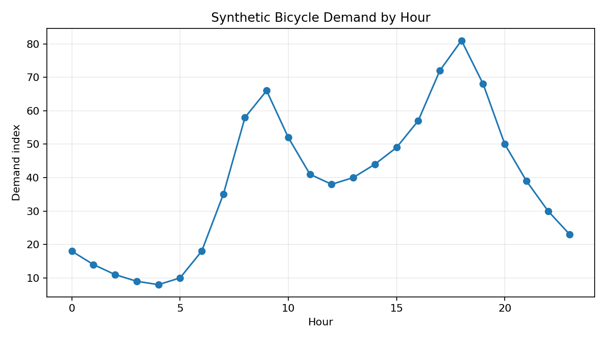

# 摘要

这是一个用于快速冒烟测试的最小合法项目，包含公式、图片、交叉引用和文献引用。

# 正文 {#sec:body}

已有测试研究讨论过类似问题 [@smith2023forecast]。

$$
z = x + y
$$ {#eq:minimal}

如式 @eq:minimal 所示，本文只验证基础公式编号。

{#fig:minimal width=65%}

图 @fig:minimal 用于验证图片路径与图编号。

# 参考文献 {-}

::: {#refs}
:::

\input{tables/not-declared.tex}
