<!-- C063-STABLE-SECTION-01 -->
# 摘要

充分利用有限的耕地资源，发展有机种植产业，对乡村经济的可持续发展具有重要的现实意义。本文基于题目给定的数据信息，针对农作物种植与销售的不同变化趋势，分别建立数学模型进行分析，为该乡村制定乐 2024\~2030 年农作物的最优种植方案，从而增加农业生产效益，确保农业农村稳定发展。

**对于问题一，** 首先，计算出 2023 年农作物种植**总收益为 592 余万元**，并对数据进行可视化展示，分析了各类农产品的产量、种植成本与利润之间的关系。其次，结合各种农产品种植特性和不同耕地资源的特点，引入不同年份、不同地块上不同作物的种植面积为决策变量，考虑 6 大类约束条件：不同地块种植作物种类约束、地块面积约束、同一地块不能连续重茬约束、三年至少种植一次豆类约束、同一作为每季种植地块数量约束和每种作物单个地块种植面积约束，给出两种不同情形下的目标函数，构建了最优种植方案模型。从模型特点出发，利用 LINGO 20.0 软件进行了求解，结果表明，若滞销部分浪费，则 7 年最大收益约为 4530 万元；若超过部分半价销售，则 7年最大收益约为 6469万元。最后，对模型中的重要参数进行了灵敏度分析。

**对于问题二，** 首先，考虑预期销售量、亩产量、种植成本和销售价格 4 类因素的随机变化，并对其随机变化分别采用均匀分布和正态分布进行描述，给出了潜在种植风险的定量描述。其次，将上述 4 类因素融入问题一建立的优化模型，将原有的稳态模型转化为随机优化模型。对该模型的求解，采用 4 类随机因素取特定数值，选取了全体参数最优、最劣、平均值等 11 组典型数据，对每组数据分别计算最优种植方案和7年最大收益值。为了找到对随机因素具有最强稳定型结果，先对 4类随机因素生成了1000 组服从均匀分布的随机数，作为 1000 中环境状态，上述得到的 11 组种植方案作为备选方案，从而构建了风险决策模型，得到了模型的益损值矩阵。分别采用乐观准则和最大期望值准则得到最优种植方案。结果表明，在面积占比不低于 25%，以超过部分半价出售为目标函数的情形下，最优种植方案的7年收益值约为6374万元

**对于问题三，** 在综合考虑作物种植的可替代性和可互补性，以及预期销售量、销售价格和种植成本三者之间的相关性，对问题 2 中的模型进行进一步修正。首先，将问题中提到的可替代性、互补性进行简单描述，并针对可种植在同一类型耕地的不同农作物进行种植的可替代性和互补性进行分析。通过相应数据分析得到预期销售量、销售价格和种植成本的相性相关性。并且通过定义的可替代性系数将相互可替代的农作物的种植面积进行关联，互补性系数对作物的亩产量进行修订，进而得到问题 3 的优化模型。针对模拟数据，利用此模型进行最优种植方案的求解。


<!-- C063-STABLE-SECTION-02 -->
# 引言 {#sec:introduction}

在全球范围内，农业生产正面临着人口增长、资源限制和气候变化等多重挑战。特别是在中国华北山区的乡村，由于其独特的地理和气候条件，农作物种植策略的优化显得尤为重要。这些地区通常耕地资源有限，且受到气候条件的限制，每年仅能种植一季作物，这使得如何合理规划种植策略，提高土地利用效率和农业生产力成为了一个关键问题。

<!-- C063-STABLE-SECTION-03 -->
# 问题重述 {#sec:problem}

## 问题背景 {#sec:problem-background}

解决好三农问题不仅对乡村经济的可持续发展具有重要的现实意义，更关乎人民粮食安全。为充分利用好有限的耕地资源，提高农业生产的质效，需因地制宜地制定优化的种植策略。

华北山区某乡村受环境限制，当地农民采取单季种植的模式从事农业生产活动，现有耕地 1201 亩，分为 34 个不同地块，类型为平旱地、梯田、山坡地和水浇地 4 种类型。平旱地、梯田和山坡地适宜每年种植一季粮食类作物；水浇地适宜每年种植一季水稻或两季蔬菜。该乡村另有 16 个普通大棚和 4 个智慧大棚，每个大棚耕地面积为 0.6 亩。普通大棚适宜每年种植一季蔬菜和一季食用菌，智慧大棚适宜每年种植两季蔬菜。同一地块（含大棚）每季可以合种不同的作物。

## 制约条件 {#sec:constraints}

**①农作物的生长规律：**

每种作物在同一地块（含大棚）都不能连续重茬种植，否则会减产；

从 2023 年开始每个地块（含大棚）的所有土地三年内至少种植一次豆类作物；

大白菜、白萝卜和红萝卜中的一种（便于管理）且只能在水浇地的第二季种植；

食用菌类只能在秋冬季的普通大棚里种植；

**②耕种管理方式：**

每种作物每季的种植地不能太分散；

每种作物在单个地块（含大棚）种植的面积不宜太小；

**③耕种环境：**

平旱地、梯田和山坡地每年适宜单季种植粮食类作物（水稻除外）；

水浇地每年可以单季种植水稻或两季种植蔬菜作物；

水浇地种植两季蔬菜，第一季可种植多种蔬菜（大白菜、白萝卜和红萝卜除外）；

水浇地第二季只能种植大白菜、白萝卜和红萝卜中的一种（便于管理）；

普通大棚每年种植两季作物，第一季可种植多种蔬菜（大白菜、白萝卜和红萝卜除外），第二季只能种植食用菌；

智慧大棚每年都可种植两季蔬菜（大白菜、白萝卜和红萝卜除外）。

## 具体要求 {#sec:requirements}

①根据假定的农作物预期销售、种植成本、亩产量和销售价格，如果某种作物每季的总产量超过相应的预期销售量，超过部分不能正常销售。针对滞销部分造成浪费和降价50%出售两种情况，建立数学模型制定2024\~2030年农作物最佳种植方案使效益最大化。

②在问题一的基础上综合考虑农作物预期销售量、亩产量、种植成本以及销售价格的的不确定性以及潜在种植风险，建立数学模型制定 2024\~2030 年农作物最佳种植方案使效益最大化。

③在问题二的基础上，结合现实生活，考综合考虑农作物预期销售量与销售价格、种植成本之间一定的相关性以及各种农作物之间的可替代性和互补性等诸多相关因素，建立数学模型，针对模拟数据制定 2024\~2030 年农作物最佳种植方案使效益最大化，并与问题 2的结果作比较分析。

<!-- C063-STABLE-SECTION-04 -->
# 问题分析 {#sec:analysis}

## 问题一的分析 {#sec:analysis-1}

问题一是一个典型的资源优化问题，要求在有限的种植面积、农作物种植特性参数、轮作要求和产量销售限制下，制定未来2024-2030年收益最大的种植方案。

首先，由于不同的作物在不同地块上的适应性差导较大，根据各地块的种植条件（包括地块面积、地块类型等）选择合适的作物。对农作物种植的布局合理，使产量扩大。

其次，农作物的轮作要求同样重要。根据要求制定约束条件，模型引入轮作约束，确保每个地块的种植规划满足作物轮作需求，对于同一地块连续三年内种植豆类农作物的总面积大于零，达到豆类作物需要在每块地的三年内至少种植一次的要求；连续两年内的同一地块种植同种农作物的面积乘积为零，确保同一块地不能连续种植相同的作物。

作物的销售量限制是另一个关键因素。在每年的种植中，如果某种作物的总产量超过了预期的销售量，超过部分将无法带来相应的收益。分别考虑两种情况：第一种情况中，超过的部分农作物滞销，导致经济损失；第二种情况中，超过的部分作物可以以销售价格的 50%降价出售，能够部分弥补损失。因此，通过取总产量和预期的销售量的最小值，根据销售单价和产量计算获得当前种植策略下的总收益。

## 问题二的分析 {#sec:analysis-2}

问题二基于问题一所建立的数学模型，考虑到小麦和玉米的未期预售销量有5%\~10%增长趋势，和其他农作物相对于2023年正负5%的变化，农作物的亩产量，每年会有%负 10%的变化，农作物种植成本。每年增长率为 5%左右，以及蔬菜类销售价格，平均每年增长 5%左右的趋势，和食用菌销售价格，每年下降 1%\~5%（羊肚菌每年下降幅度 5%）的不确定性因素，综合考虑这些不确定因素，来制定最优的种植方案以求到收益最大化。

根据多种不确定因素的存在，我们首先利用蒙特卡罗模拟得到多种随机状态下，利用问题一中的模型来得到各种状态下的最优方案，并通过此状态下的最优方案计算出其他随机状态下的收益情况，选取稳健优化方法，即在不确定环境中寻找最坏情况下的最优解的方法，综合评估各种方案。最后把 2024203 年农作物潜在的种植风险，如当地发生自然灾害导致农作物产量大幅度降低、市场上某作物产教较大导致的价格大幅度降低等潜在风险，考虑进去对上述方案进行检验和调整，最终得到 2024-2030年的最优的种植方案。

## 问题三的分析 {#sec:analysis-3}

问题三更贴近现实生活。是在问题二的基础上综合考虑了各种农作物之间的可替代性和可互补性，以及预期销售量、销售价格和种植成本三者之间的相关性进行建模求解。因为相关因素未给出，需要通过定义来确定其相关性等。相对前两问更加开放。

<!-- C063-STABLE-SECTION-05 -->
# 符号声明 {#sec:symbols}

本文中涉及到的主要变量符号说明：


注：未声明的变量以其在符号出现处的具体说明为准。

<!-- C063-STABLE-SECTION-06 -->
# 问题一的模型建立与求解 {#sec:model-1}

|                **符号**                 |       **符号含义及说明**        |
| :------------: | :------------------------------------: |
|                   t                   |            年份            |
|                   i                   |           地块编号           |
|                  $j$                  |          农作物编号           |
|         $d _ { i j } ^ { t }$         | 第t年在第i块地种植j作物每亩的产量（斤/亩）  |
|         $e _ { i j } ^ { t }$         | 第t年在第i块地种植j 作物每亩的成本（元/亩） |
|              $p _ { j }$              |     农作物j的平均销售单价（元/斤）     |
|       $\mathit{total}_{ij}^{t}$       |   第t年在第i块耕地上种植农作物 j的产量   |
|        $\mathit{pre}_{j}^{t}$         |     第 t 年农作物 j的预期销售量     |
|         $x _ { i j } ^ { t }$         | 第t年份第一季（单季）第i地块种植农作物j的面积 |
|         $y _ { i j } ^ { t }$         |  第t年份第二季第i 地块种植农作物 j的面积  |
| $\boldsymbol { W } _ { i j } ^ { t }$ | 第 t 年在第 i 块地种植 j 作物获得的利润 |
|          $I _ { j } ^ { t }$          |     第t 年在种植j作物产生的收入      |
|         $C _ { i j } ^ { t }$         |  第t 年在第i 块地种植 j作物产生的支出   |
|              $a _ { i }$              |        第i 块地块的面积         |
|              $m _ { j }$              |     同一种j作物种植地块个数的最大值     |
|               $\alpha$                |    同一作物种植面积在该地块中的最小占比    |
|       $\gamma _ { j } ^ { t }$        |        预期销售量年变化率         |
|       $\delta _ { j } ^ { t }$        |     第t年生产j作物的亩产量变化率      |

: 变量符号说明 {#tbl:c063-001 width=auto}

## 模型建立 {#sec:c063-5-1}

问题一的核心在于如何在有限的种植面积、销售量限制和轮作要求的前提下，合理分配每年的作物种植面积，并根据两种销售处理方式，最大化总收益。线性规划模型是解决该问题的主要工具，通过建立决策变量（每块地每年种植的作物面积）、目标函数（总收益最大化）和约束条件（面积限制、销售限制、轮作限制等），可以有效地求解最优种植方案。

### 数据分析与处理 {#sec:c063-5-1-1}

根据本题给出的乡村的现有耕地和乡村现有耕地可种植的农作物以及 2023 年农作

物种植情况和统计的相关数据，做了如下数据预处理。

**①耕地数据：**

由题目和附件1“乡村的现有耕地”工作表中的说明可知水浇地、普通大棚以及智慧大棚每年可以种植两季农作物，则在分析此问题时需要考虑到每年两次种植策略。

经数据分析，现存耕地 54 块（包含普通大棚和智慧大棚），农作物种类 41 种。此处将 54 个耕地地块用 i (i = 1,2,...,54) 表示，种植作物类型用 j $( j = 1 , 2 , . . . , 4 1 )$表示，种植年份用 t (t = 2024,2025,...,2030) 表示，农作物的种植面积用 x 和 y 表示（其中 x表示第一季种植面积、 y表示第二季种植面积），当某地块只能种一季作物时第二季度作物种植面积 为零。

**②农作物销售单价预处理：**

由于附件 2“2023 年统计的相关数据”工作表中给定的各种农作物销售单价为范围取值，此处采用平均值法，价格最大值和最小值的平均值为每种农作物的销售单价，使用$p _ { j }$表示，如下表所示：

| **作物名称** | **种植季次** | **平均销售单价/(元/斤)** | **作物名称** | **种植季次** | **平均销售单价/(元/斤)** |
| :---: | :---: | :------: | :---: | :---: | :------: |
| 黄豆 | 单季 | 3.25 | 辣椒 | 第一季 | 7.25 |
| 黑豆 | 单季 | 7.5 | 空心菜 | 第一季 | 4.5 |
| 红豆 | 单季 | 8.25 | 黄心菜 | 第一季 | 4.5 |
| 绿豆 | 单季 | 7 | 芹菜 | 第一季 | 4 |
| 刀豆 | 第一季 | 6.75 | 菠菜 | 第二季 | 6.9 |
| 芸豆 | 第一季 | 6.5 | 青椒 | 第二季 | 6.8 |
| 土豆 | 第一季 | 3.75 | 菜花 | 第二季 | 6.6 |
| 西红柿 | 第一季 | 6.25 | 包菜 | 第二季 | 7.8 |
| 茄子 | 第一季 | 5.5 | 油麦菜 | 第二季 | 6 |
| 菠菜 | 第一季 | 5.75 | 小青菜 | 第二季 | 6.9 |
| 青椒 | 第一季 | 5.25 | 黄瓜 | 第二季 | 8.4 |
| 菜花 | 第一季 | 5.5 | 生菜 | 第二季 | 6.3 |
| 包菜 | 第一季 | 6.5 | 辣椒 | 第二季 | 8.7 |
| 油麦菜 | 第一季 | 5 | 空心菜 | 第二季 | 5.4 |
| 小青菜 | 第一季 | 5.75 | 黄心菜 | 第二季 | 5.4 |
| 黄瓜 | 第一季 | 7 | 芹菜 | 第二季 | 4.8 |

: 平均销售单价表 {#tbl:c063-002 width=85% ratios="1:1:2:1:1:2"}

**③2023 年种植收益：**

由 2023 年各类农作物的平均销售单价和 2023 年农作物种植情况计算得出每个种植地块的收益情况和 2023 年总收益，可得以下列表，计算得 2023 年总收益为5926348.25 元。

亩收入=农作物平均销售单价\*农作物亩产量\*种植面积；

亩支出=种植成本\*种植面积；

农作物收益=（亩收入-亩支出）\*种植面积。

| **种植地块** | **作物名称** | **种植面积/亩** | **种植季次** | **收益情况/元** |
| :---: | :---: | :---: | :---: | :---: |
| A1 | 小麦 | 80 | 单季 | 188000 |
| A2 | 玉米 | 55 | 单季 | 137500 |
| A3 | 玉米 | 35 | 单季 | 87500 |
| A4 | 黄豆 | 72 | 单季 | 64800 |
| A5 | 绿豆 | 68 | 单季 | 142800 |
| A6 | 谷子 | 55 | 单季 | 128700 |
| B1 | 小麦 | 60 | 单季 | 132600 |
| B2 | 黑豆 | 46 | 单季 | 145475 |
| B3 | 红豆 | 40 | 单季 | 111400 |
| B4 | 绿豆 | 28 | 单季 | 54880 |
| B5 | 爬豆 | 25 | 单季 | 57906.25 |
| B6 | 谷子 | 86 | 单季 | 189630 |
| B7 | 小麦 | 55 | 单季 | 121550 |
| B8 | 谷子 | 44 | 单季 | 97020 |
| B9 | 高粱 | 50 | 单季 | 160000 |
| B10 | 黍子 | 25 | 单季 | 84750 |
| B11 | 黄豆 | 60 | 单季 | 50100 |
| B12 | 玉米 | 45 | 单季 | 105750 |
| B13 | 莜麦 | 35 | 单季 | 63000 |
| B14 | 大麦 | 20 | 单季 | 28000 |
| C1 | 荞麦 | 15 | 单季 | 54750 |
| C2 | 南瓜 | 13 | 单季 | 39650 |
| C3 | 黄豆 | 15 | 单季 | 11550 |
| C4 | 红薯 | 18 | 单季 | 81000 |
| C5 | 小麦 | 27 | 单季 | 55890 |
| C6 | 红豆 | 20 | 单季 | 52400 |

: 2023年收益情况表 {#tbl:c063-003 width=auto}

**④预期销售量：**

问题 1 假定各种农作物未来的预期销售量、种植成本、亩产量和销售价格相对于2023 年保持稳定，每季种植的农作物在当季销售。如果某种作物每季的总产量超过相应的预期销售量，超过部分不能正常销售，滞销部分造成浪费或者降价50%出售。

$\mathit{total}_{j}^{t}$表示为第t年种植农作物$j$的产量总和；

$\mathit{pre}_{j}^{t}$表示为第t年农作物 j的预期销售量；

以2023年农作物产量为未来预期销售量，则有：

$$
\mathit{pre} _ { j } ^ { t } = \mathit{total} _ { j } ^ { 2023 }
$$

针对问题 1 的第①种情况，滞销部分造成浪费，则使得种植成本增大从而降低总收益。则须考虑：

$$
\mathit{total} _ { j } ^ { t } \le \mathit{pre} _ { j } ^ { t }
$$

使得未来农作物产量小于等于预期销售量，减少滞销部分；

针对问题1的第②种情况，滞销部分按照降价50%的价格销售，则根据价格制定种植策略。根据不同种类的农作物，在 2023 年第 1季和第 2 季的总产量做出如下图，可发现其中小麦和玉米等粮食作物的产量较高。

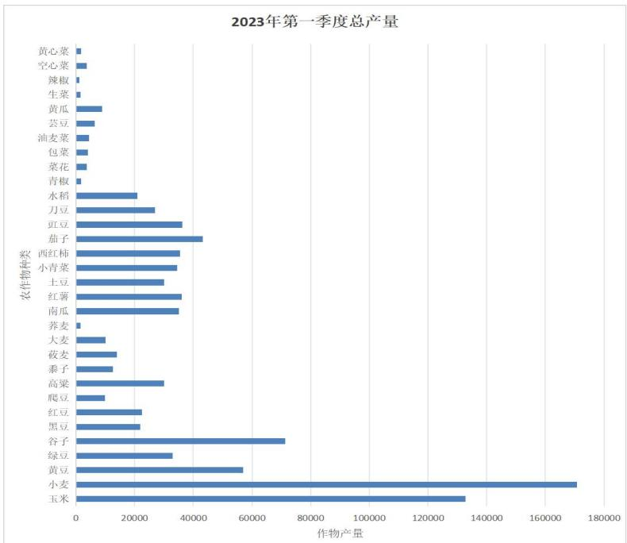{#fig:c063-01 width=70%}  

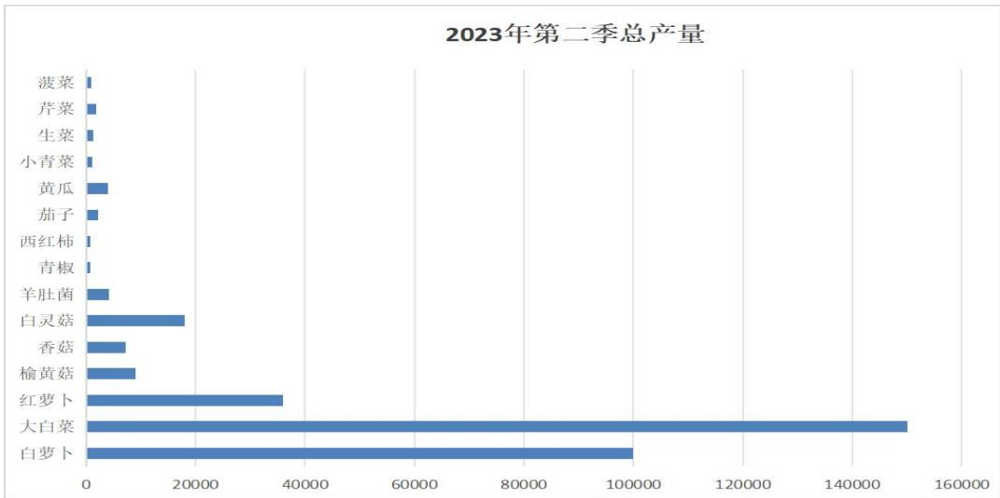{#fig:c063-02 width=90%}  

由于只有水浇地和普通大棚，智慧大棚有第二季度作物种植，所以第 2 季度的总产量，大白菜和白萝卜等蔬菜类农作物占比产量较高，根据不同地块类型，来分析2023 年不同类型的耕地上种植农作物类型占比，下面是平旱地，梯田、山坡地，不同农作物种植占比：

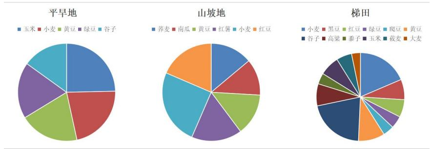{#fig:c063-03 width=75%}


水浇地和大棚属于两季种植耕地，下面分别分析了他们的第 1 季和第 2 季的农作物种植：

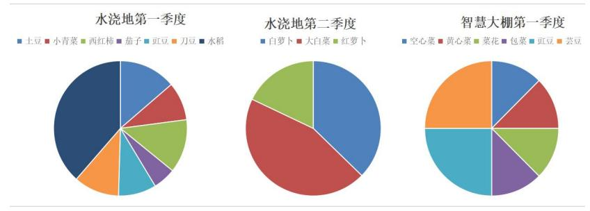{#fig:c063-04a width=70%}

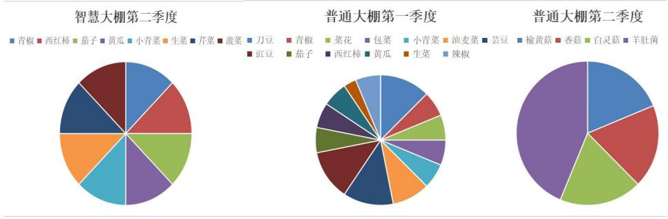{#fig:c063-04b width=80%}  

根据每亩农产品销售金额=亩产量\*平均销售单价可以分析对比在不同地块上种植各类农作物，每亩种植成本和收入的数据折线图，如下：

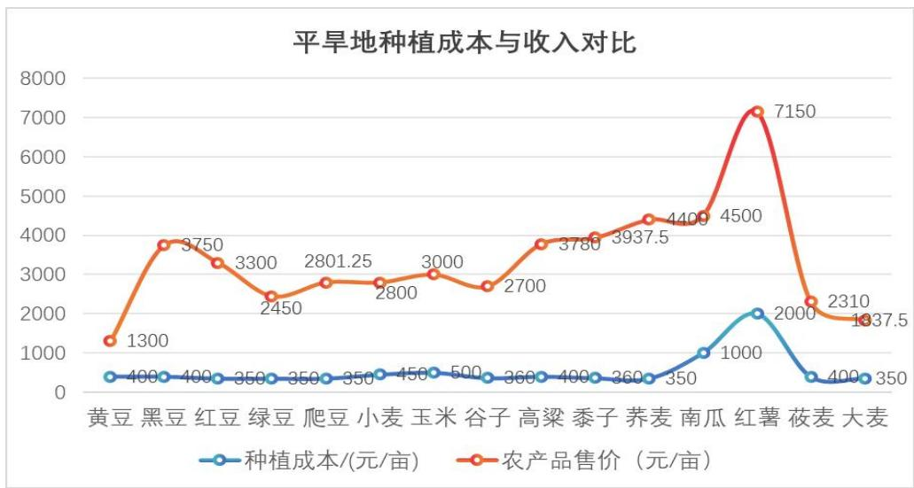{#fig:c063-05 width=85%}  

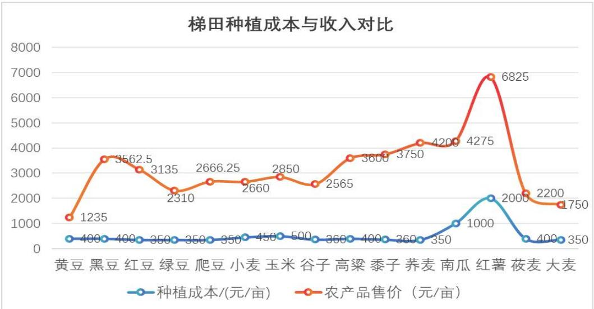{#fig:c063-06 width=90%}  

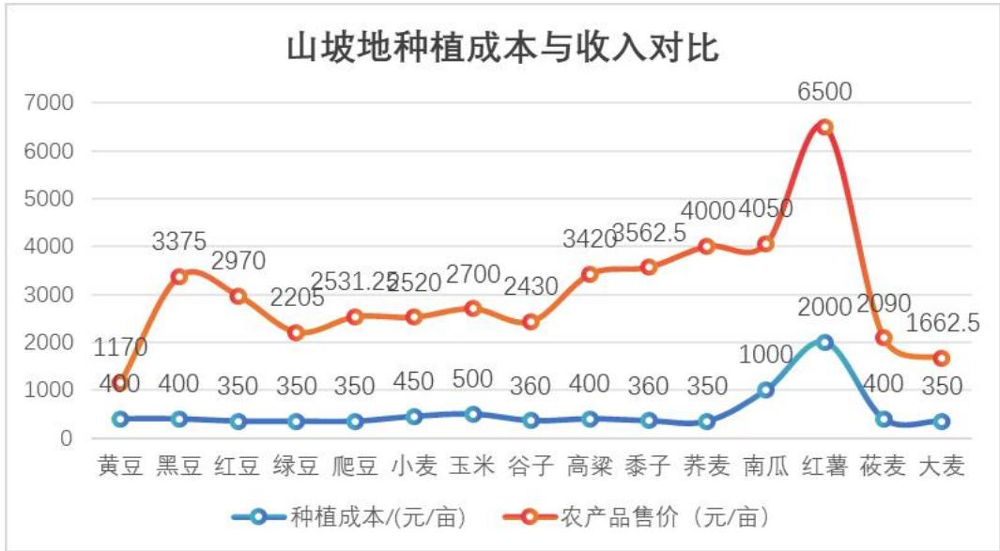{#fig:c063-07 width=90%}  

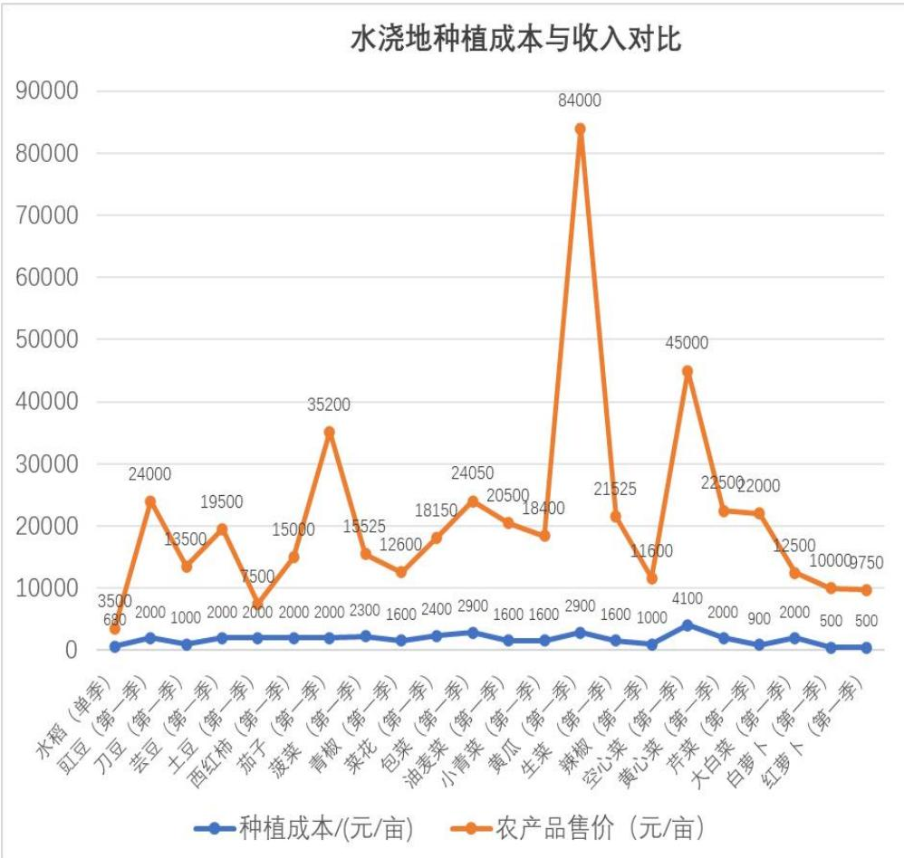{#fig:c063-08 width=85%}

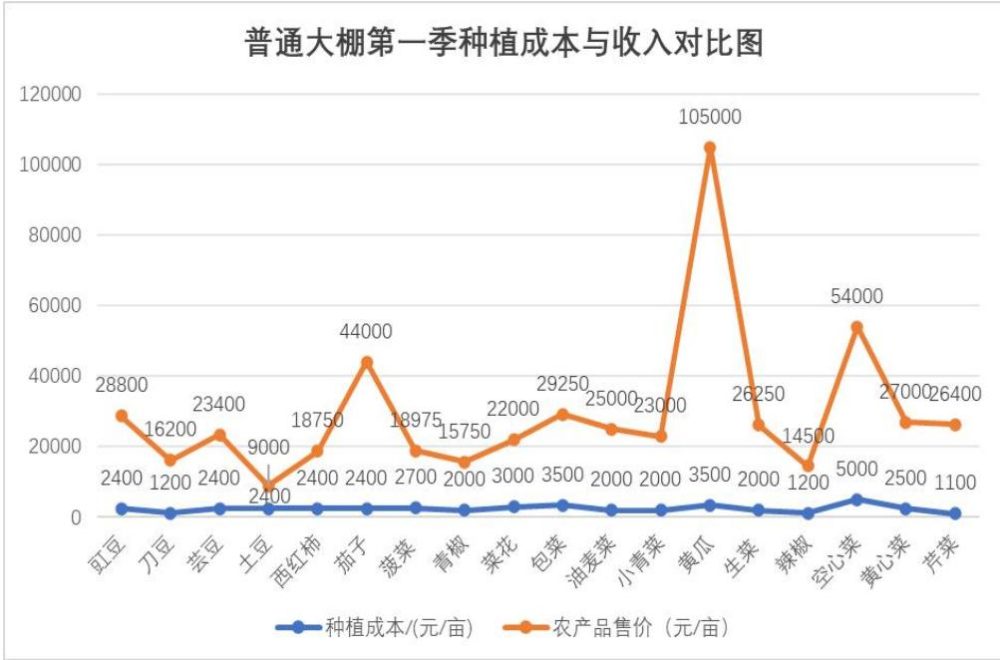{#fig:c063-09 width=85%}  

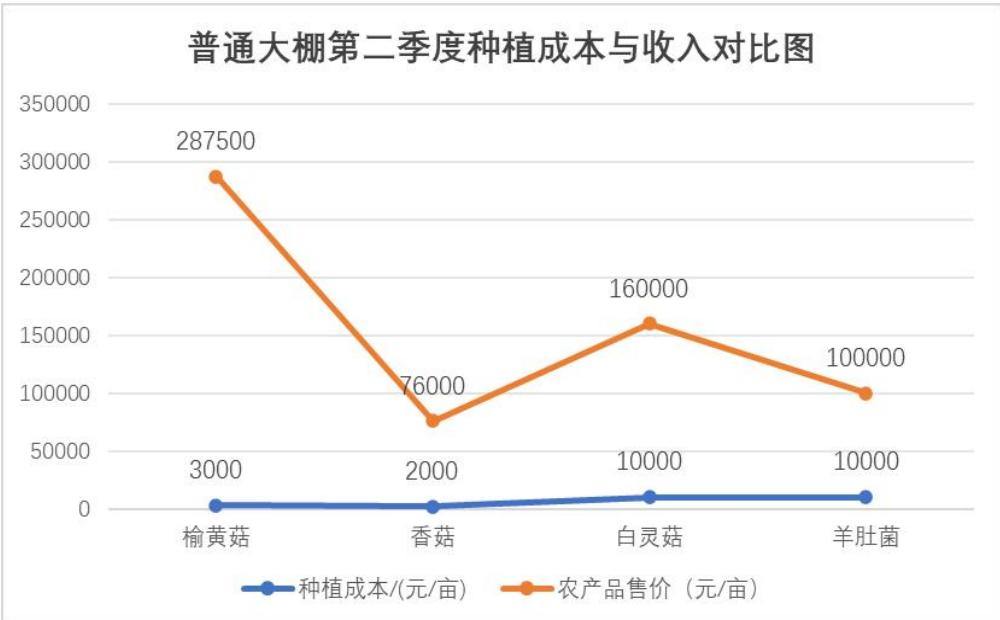{#fig:c063-10 width=85%}

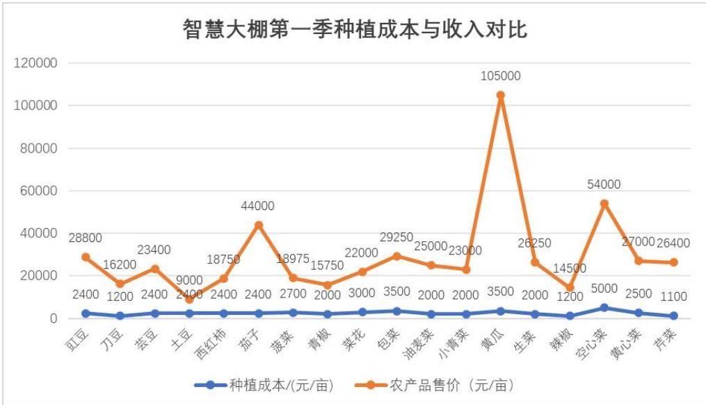{#fig:c063-11 width=85%}  

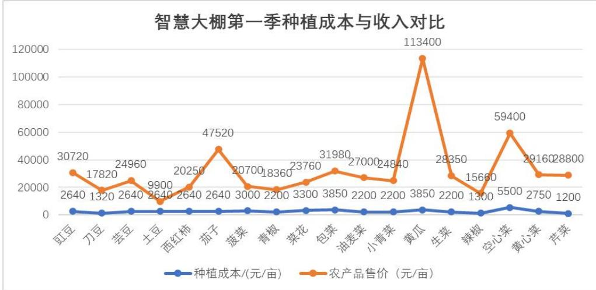{#fig:c063-12 width=85%}  

### 种植模型建立 {#sec:c063-5-1-2}

**①决策变量**

为获得最优的种植方案，我们给出决策变量$x _ { i j } ^ { t }$表示第 t 年份第一季（单季）第 i地块种植农作物 j 的面积$y _ { i j } ^ { t }$表示第 t 年份第二季第 i 地块种植农作物 j 的面积，其中：

i表示54个耕地地块（包含普通大棚和智慧大棚）；

j表示种植作物类型；

t表示种植年份；

x、 y表示农作物的种植面积，x表示第一季种植面积， y表示第二季种植面积。当地块只能种单季作物时，第二季度作物种植面积为零，即在第t年份第i地块种植农作物 j的面积为：

$$
\left\{ \begin{array} { c c } { x _ { i j } ^ { t } } & { j \leq 1 6 } \\ { x _ { i j } ^ { t } + y _ { i j } ^ { t } } & { j > 1 6 } \end{array} \right.
$$

用 0-1 变量 F 表示在第t年份第i地块第一季是否种植农作物 j，当 F 为 1 时表示种植该农作物，为 0时表示未种植该农作物

$$
F ( x _ { i j } ^ { t } ) = \left\{ \begin{array} { l l } { 0 } & { x _ { i j } ^ { t } \leq 0 } \\ { 1 } & { x _ { i j } ^ { t } > 0 } \end{array} \right.
$$

用 0-1 变量 G 表示在第t年份第i地块第二季是否种植农作物 j，当 G 为 1 时表示种植该农作物，为 0时表示未种植该农作物

$$
G ( x _ { i j } ^ { t } ) = \left\{ { \begin{array} { l l } { 0 } & { y _ { i j } ^ { t } \leq 0 } \\ { 1 } & { y _ { i j } ^ { t } > 0 } \end{array} } \right.
$$

**（2）确立目标函数**

经分析可确定最优方案为按照此方案种植，可使得 2024\~2030 年农作物获得的利润最大化：

W 表示 2024\~2030 年农作物的销售总利润；

I 表示2024\~2030 年农作物种植的收入；

C表示 2024\~2030 年农作物种植成本。

根据经济学中总利润=总收入-总支出，考虑到滞销部分有两种处理方式，则需要

将目标函数分情况讨论：

总收入：

**①超过部分滞销，造成浪费：**

$$
I = \sum _ { t } \sum _ { j = 1 } ^ { 4 1 } \sum _ { i = 1 } ^ { 5 4 } p _ { i j } \cdot \min ( \mathit{total} _ { j } ^ { t } , \mathit{pre} _ { j } ^ { t } )
$$

**②超过部分按2023 年销售价格的 50%降价出售：**

$$
I = \sum _ { t } \sum _ { j = 1 } ^ { 4 1 } \sum _ { i = 1 } ^ { 5 4 } p _ { i j } \cdot [ \min ( \mathit{total} _ { j } ^ { t } , \mathit{pre} _ { j } ^ { t } ) + \frac { 1 } { 2 } \max ( 0 , ( \mathit{total} _ { j } ^ { t } - \mathit{pre} _ { j } ^ { t } ) ]
$$

总支出：

$$
C = \sum _ { t } \sum _ { j = 1 } ^ { 4 1 } \sum _ { i = 1 } ^ { 5 4 } e _ { i j } ^ { t } \cdot x _ { i j } ^ { t }
$$

总利润：

$$
W = I - C
$$

其中：

$d _ { i j } ^ { t }$为第t年在第i块地种植 j作物每亩的产量；

$e _ { i j } ^ { t }$为第t年在第i块地种植$j$作物每亩的成本；

$p _ { j }$为作物 j销售单价；

第t 年总共的农作物 j产量为：

$$
\mathit{total} _ { j } ^ { t } = \sum d _ { i j } ^ { t } \cdot x _ { i j } ^ { t }
$$

**（3）设立约束条件**

**①地块种植农作物面积不宜太小**

第t年在地块i上种植的单季、第一季或者第二季种植次数的农作物种植面积总和不能超过该地块面积$a _ { i }$：

$$
\sum _ { j = 0 } ^ { 4 1 } x _ { i j } ^ { t } \le a _ { i }
$$

$$
\sum _ { j = 0 } ^ { 4 1 } y _ { i j } ^ { t } \le a _ { i }
$$

**②不同地块可种植的农作物类型不同**

由于不同地块可种植的农作物类型不同，此处以种植耕地类型分开讨论。

类型1：平旱地、梯田、山坡地每年适宜单季种植粮食类作物（除水稻）：

$$
F ( x _ { i j } ^ { t } ) + F ( x _ { i j } ^ { t + 1 } ) \leq 1 \qquad j \leq 1 5
$$

$$
F ( x _ { i j } ^ { t } ) + F ( x _ { i j } ^ { t + 1 } ) \leq 1
$$

类型2：水浇地每年可以单季种植水稻或两季种植蔬菜作物：

若在某块水浇地种植两季蔬菜，第一季可种植多种蔬菜（大白菜、白萝卜和红萝卜除外）；第二季只能种植大白菜、白萝卜和红萝卜中的一种

$$
\left\{ \begin{array} { c c } { x _ { i j } ^ { t } > 0 \qquad } & { i = 2 7 , 2 8 . . . 3 4 ; \ j = 1 6 } \\ { x _ { i j } ^ { t } = 0 \qquad } & { \mathrm{else} } \end{array} \right.
$$

$$
\left\{\begin{aligned}
x_{ij}^{t} &> 0, && i=27,28,\ldots,34;\ j=17,18,\ldots,34, \\
y_{ij}^{t} &> 0, && i=27,28,\ldots,34;\ j=35,36,37.
\end{aligned}\right.
$$

类型3：普通大棚每年第一季适宜种植特定蔬菜，第二季适宜种植食用菌

$$
\begin{array} { r } { \left\{ \begin{array} { l l } { x _ { i j } ^ { t } > 0 } & { \ i = 3 5 , 3 6 . . . 5 0 ; \ j = 1 7 , 1 8 . . . 3 4 } \\ { x _ { i j } ^ { t } = 0 } & { \mathrm{else} } \end{array} \right. } \end{array}
$$

类型$4 { : }$：智慧大棚每年可种植两季蔬菜（大白菜、白萝卜和红萝卜除外）

$$
\begin{array} { r } { \left\{ \begin{array} { l l } { y _ { i j } ^ { t } > 0 } & { i = 3 5 , 3 6 . . . 5 0 ; \ j = 3 8 , 3 9 . . . 4 1 } \\ { y _ { i j } ^ { t } = 0 } & { \mathrm{else} } \end{array} \right. } \end{array}
$$

**③每种作物在同一地块（含大棚）不能重茬种植**

根据农作物的生长规律，每种作物在同一地块（含大棚）都不能连续重茬种植，由于地块分为只能种一季的耕地类型（平旱地、梯田、山坡地）和能种两季的耕地类型（智慧大棚和普通大棚）两种类型，并且水浇地能种植一季水稻或者两季特定蔬菜。由于同一块地可以种多种农作物，我们规定在同一块地上两年内是否种植同一种农作物的判断方式为两年内种植面积是否大于地块面积，即：

$$
x _ { i j } ^ { t } + x _ { i j } ^ { t + 1 } \leq a _ { i }
$$

当达到此条件，则可不做约束讨论。若：

$$
x _ { i j } ^ { t } + x _ { i j } ^ { t + 1 } > a _ { i }
$$

则下面将它们分类进行讨论：

类型1：只能种一季的地块（平旱地、梯田、山坡地）不重茬种植

$$
F ( x _ { i j } ^ { t } ) + F ( x _ { i j } ^ { t + 1 } ) \leq 1
$$

类型2：能种两季的地块（智慧大棚和普通大棚）不重茬种植，对于普通大棚同一年份第一季度种植作物类型与第二季度作物类型不交叉，不会出现同一地块连续种植相同作物的情况，故只需要分析智慧大棚即可

$$
\left\{ \begin{array} { c } { F ( x _ { i j } ^ { t } ) + G ( y _ { i j } ^ { t } ) \leq 1 } \\ { G ( y _ { i j } ^ { t } ) + F ( x _ { i j } ^ { t } ) \leq 1 } \end{array} \right.
$$

类型3：水浇地不重茬种植，水浇地较为特殊能种植一季水稻或者两季蔬菜，给出的数据水稻只有一种类型，则在同一地块水稻不能连续种植，并且经过分析水浇地种植蔬菜第一季度和第二季度的类型不交叉，所以水浇地种植蔬菜肯定不会出现同一水浇地块的重茬种植问题

$$
F ( x _ { i j } ^ { t } ) + F ( x _ { i j } ^ { t + 1 } ) \leq 1
$$

**④每个地块的所有土地三年内必须种植一次豆类作物**

每个地块（含大棚）的所有土地三年内至少种植一次豆类作物，我们认为对于同一块地块，若其三年内种植豆类作物的总种植面积大于该地块的总面积，则认为该土地三年内种植过一次豆类作物。下面分别对单季种植和可种植两季的地块进行讨论：

类型1：三年内单季度种植的地块（平旱地、梯田、山坡地）的约束条件：

$$
\sum _ { j = 1 } ^ { 5 } \bigl ( x _ { i j } ^ { t } + x _ { i j } ^ { t + 1 } + x _ { i j } ^ { t + 2 } \bigr ) \geq a _ { i }
$$

类型 2：三年内可两季度种植的地块（普通大棚、智慧大棚和水浇地）的约束条件：

$$
\sum _ { j = 1 7 } ^ { 1 9 } ( x _ { i j } ^ { t } + y _ { i j } ^ { t } + x _ { i j } ^ { t + 1 } + y _ { i j } ^ { t + 1 } + x _ { i j } ^ { t + 2 } + y _ { i j } ^ { t + 2 } ) \geq a _ { i }
$$

**⑤某年份每种作物每季的种植地尽量集中**

设计方案考虑到方便耕种作业的田间管理，需要求农作物的种植尽量集中。由于为给定相对集中的标准，此处设定一个阈值为约束条件，种植农作物的地块个数应小于阈值，使用地块的数量受到控制，从而限制农作物的种植相对集中。

$$
\sum _ { i } F ( x _ { i j } ^ { k } ) \le m _ { j }
$$

$$
\sum _ { i } G ( x _ { i j } ^ { k } ) \leq m _ { j }
$$

其中$d _ { j }$为设定的某年份同一种作物种植地块个数的最大值,通过分析 2023 年的农作物种植情况，我们可以得到只有羊肚菌的种植地块有 7 个，其他农作物种植地块数量全部小于5 块，所以这里的$d _ { j }$取5。

**⑥每种作物在单个地块（含大棚）种植面积不宜太小**

题中要求在单个地块上种植单一农作物的面积不宜太小，因此将同一种农作物种植占当前地块设置为约束条件。因为大小未给出统一规定，此处采用百分比的方式定义太小的种植面积，我们设定一个地块上种植同一种农作物所占用的面积须大于最小占比：

$$
x _ { i j } ^ { t } \geq \alpha \cdot a _ { i }
$$

$$
y _ { i j } ^ { t } \geq \alpha \cdot a _ { i }
$$

其中$\alpha$为同一作物种植面积在该地块中的最小占比。

**（4）优化模型的整合呈现**

**①超过部分滞销造成浪费：**

$$
W=\sum_{t}\sum_{j=1}^{41}\sum_{i=1}^{54}
\left[
p_{ij}\cdot\min(\mathit{total}_{j}^{t},\mathit{pre}_{j}^{t})
-e_{ij}^{t}\cdot x_{ij}^{t}
\right]
$$

$$
\mathrm{st.}\quad
\left\{
\begin{gathered}
\textstyle\sum_{j=0}^{41} x_{ij}^{t} \le a_i
\\[4pt]
\textstyle\sum_{j=0}^{41} y_{ij}^{t} \le a_i
\\[4pt]
F(x_{ij}^{t})+F(x_{ij}^{t+1}) \le 1 \qquad j \le 15
\\[4pt]
F(x_{ij}^{t})+F(x_{ij}^{t+1}) \le 1
\\[4pt]
x_{ij}^{t}+x_{ij}^{t+1} \le a_i
\\[4pt]
\textstyle\sum_{j=1}^{5}\left(x_{ij}^{t}+x_{ij}^{t+1}+x_{ij}^{t+2}\right) \ge a_i
\\[4pt]
\textstyle\sum_{j=17}^{19}\left(x_{ij}^{t}+y_{ij}^{t}+x_{ij}^{t+1}+y_{ij}^{t+1}+x_{ij}^{t+2}+y_{ij}^{t+2}\right) \ge a_i
\\[4pt]
\textstyle\sum_{i} F_{ij}^{k} \le d_j
\\[4pt]
\textstyle\sum_{i} G_{ij}^{k} \le d_j
\\[4pt]
x_{ij}^{t} \ge \alpha_i \cdot a_i
\\[4pt]
y_{ij}^{t} \ge \alpha_i \cdot a_i
\end{gathered}
\right.
$$

**②超过部分滞销，按 2023 年的销售价格 50%出售：**

$$
W=\sum_{t}\sum_{j=1}^{41}\sum_{i=1}^{54}
\left[
p_{ij}\cdot\min(\mathit{total}_{j}^{t},\mathit{pre}_{j}^{t})
+\frac{1}{2}\max(0,\mathit{total}_{j}^{t}-\mathit{pre}_{j}^{t})
-e_{ij}^{t}\cdot x_{ij}^{t}
\right]
$$

$$
\mathrm{st.}\quad
\left\{
\begin{gathered}
\textstyle\sum_{j=0}^{41} x_{ij}^{t} \le a_i
\\[4pt]
\textstyle\sum_{j=0}^{41} y_{ij}^{t} \le a_i
\\[4pt]
F(x_{ij}^{t})+F(x_{ij}^{t+1}) \le 1 \qquad j \le 15
\\[4pt]
F(x_{ij}^{t})+F(x_{ij}^{t+1}) \le 1
\\[4pt]
x_{ij}^{t}+x_{ij}^{t+1} \le a_i
\\[4pt]
\textstyle\sum_{j=1}^{5}\left(x_{ij}^{t}+x_{ij}^{t+1}+x_{ij}^{t+2}\right) \ge a_i
\\[4pt]
\textstyle\sum_{j=17}^{19}\left(x_{ij}^{t}+y_{ij}^{t}+x_{ij}^{t+1}+y_{ij}^{t+1}+x_{ij}^{t+2}+y_{ij}^{t+2}\right) \ge a_i
\\[4pt]
\textstyle\sum_{i} F_{ij}^{k} \le d_j
\\[4pt]
\textstyle\sum_{i} G_{ij}^{k} \le d_j
\\[4pt]
x_{ij}^{t} \ge \alpha_i \cdot a_i
\\[4pt]
y_{ij}^{t} \ge \alpha_i \cdot a_i
\end{gathered}
\right.
$$

## 模型分析与求解 {#sec:c063-5-2}

### 模型求解 {#sec:c063-5-2-1}

问题一建立的最优种植方案模型是典型的规划模型，其决策变量为三维变量，数量大；约束条件尽管类别多、且同一类别又针对不同地形、作物等有不同约束，但多数约束均为线性约束；目标函数除取大取小外，也为线性关系。因此，该模型非常适合利用LINGO软件进行求解。

采用LINGO 20.0软件求解问题一模型的主要步骤如下：

Step1：定义各类变量。包括一维变量：分别是与地块编号、作物编号和年份编号相关的变量，如地块面积等；二维变量：包括地块与作物联合的变量，如不同地块上不同作物的亩产量等；三维变量，包括地块、作物、年份联合的变量，如不同年份不同地块种植不同作物的面积等。

Step2：数据的导入。此过程需要对数据进行预处理，例如，附件 2 给出了 2023年种植方案中的亩产量，需要该列数据转化为以地块为行、作物为列的矩阵，该矩阵元素为不同地块上不同作物的亩产量，不能种植的情况亩产量设为 0。多个数据均需进行处理。

Step3：约束条件的描述。LINGO 软件的巨大优势在于命令语句描述与数学模型表达式的高度相似性。

Step4：目标函数的描述。与约束条件描述类似。

Step5：求解结果的导出。将求解得到的最优种植方案及各年的收益值直接导出到EXCEL 表中。

Step5：LINGO 软件求解器的选择。选取全局最优求解器（Global Solver），变量取值上限调整为 1000000.

## 方案结果分析 {#sec:c063-5-3}

### 灵敏度分析 {#sec:c063-5-3-1}

**（1）面积占比**

设第 i 种农作物在第 t 年的地块总数为$\mathit{Num}_{i}^{t}$，在固定每种农作物的地块总数为$2 \cdot (\mathit{Num}_{i}^{2023} + 1)$的条件下，对面积占比进行调整，得到如下散点图：

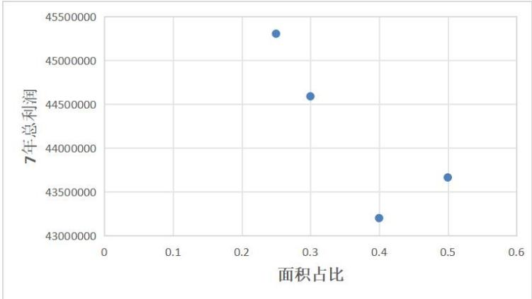{#fig:c063-17 width=65%}  

由散点图可知，在该地块总数条件下时，当面积占比为 0.25 时，七年总利润达到最大值，因此在该地块总数条件下，面积占比=0.25即为最优种植方案。

**（2）地块总数**

设第 i 种农作物在第 t 年的面积占比为$\mathit{pro}_{i}^{t}$，在固定每种农作物的种植每地块的面积占比=0.25的条件下，对地块总数进行调整，得到如下柱状图：

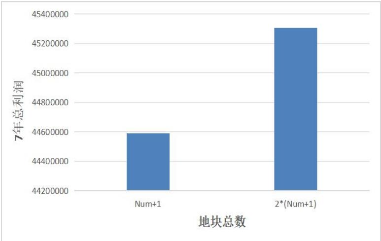{#fig:c063-18 width=65%}  

由柱状图可知，在该面积占比条件下，当地块总数为$2 \cdot (\mathit{Num}_{i}^{2023} + 1)$时，7 年总利润较高，因此该地块总数即为最优种植方案。

### 收益分析 {#sec:c063-5-3-2}

**（1）年利润变化**

在固定地块总数$\mathit{Num}_{i}^{t}$和面积占比$\mathit{pro}_{i}^{t}$下，对每年年利润进行数据分析，得到如下折线图：

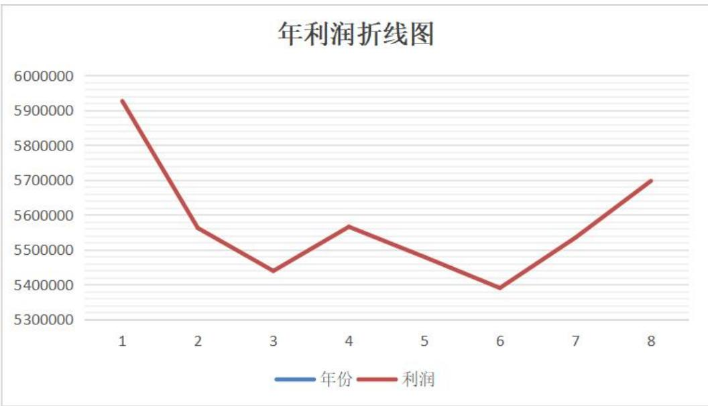{#fig:c063-19 width=90%}  

由该折线图可知，在固定地块总数$\mathit{Num}_{i}^{t}$和面积占比$\mathit{pro}_{i}^{t}$的约束下，对开始时年利润影响较大，后再正确规划后影响逐渐减小但任然存在。

**（2）年种植情况变化**

在固定地块总数$\mathit{Num}_{i}^{t}$和面积占比$\mathit{pro}_{i}^{t}$下，对每年农作物种植情况进行数据分析，得到如下折线图：

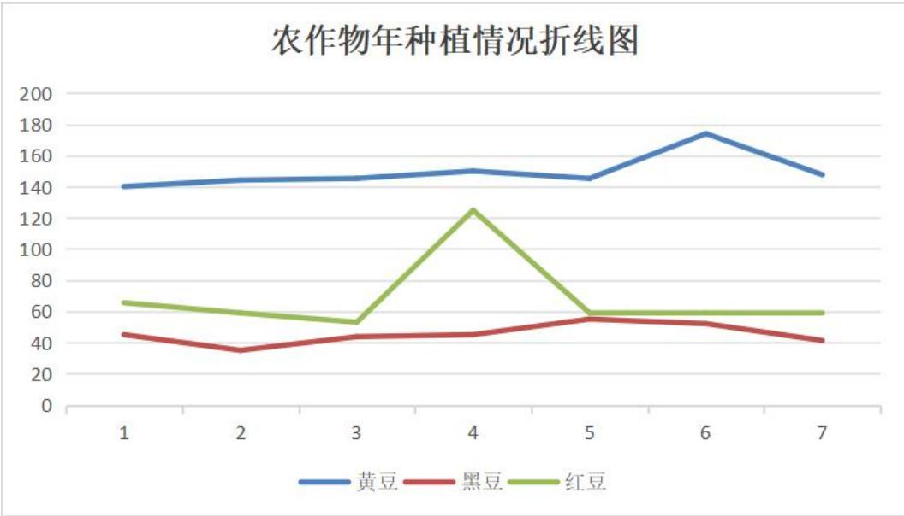{#fig:c063-20 width=90%}  

由该折线图可知，在固定地块总数$\mathit{Num}_{i}^{t}$和面积占比$\mathit{pro}_{i}^{t}$的约束下，年种植情况相对稳定，农作物每年种植数量较为固定无较大波动。

<!-- C063-STABLE-SECTION-07 -->
# 风险决策后种植方案模型建立与求解 {#sec:model-2}

## 模型分析 {#sec:c063-6-1}

问题二是在问题一所建立的数学模型基础上进行计算求解。问题二综合考虑到不同农作物的诸多不确定性因素以及潜在种植风险，进行数学模型的建立和最优方案求解，使收益最大化，相对问题一更加复杂。此外问题还具有开放性，需假设潜在的种植风险。我们利用蒙特卡罗模拟得到多种随机状态下，利用问题一中的模型来得到各种状态下的最优方案，并通过此状态下的最优方案计算出其他随机状态下的收益情况，选取稳健优化方法，找到面对潜在风险损失最小的种植方案。

我们需要综合考虑农作物的预期销售量、亩产量、种植成本和销售价格的不确定性因素以及潜在的种植风险，给出乡村2024\~2030年农作物的最优种植方案。

根据问题二所示，不确定因素可以分为：

**①受自然影响的因素：**

农作物每年的亩产量会受气候等因素影响，变化范围为±10%；

**②受预期和市场影响的因素：**

农作物种植成本每年平均增长 5%左右；

小麦和玉米未来的预期销售量有增长趋势，年增长率在+5%到+10%之间，其他作物的预期销售量可能相对于 2023 年约有±5%的变化；

蔬菜类作物的销售价格有增长的趋势，平均每年增长5% 左右；

食用菌的销售价格稳中有降，每年下降约$1 \% ^ { \sim }$ 5%；

蔬菜类作物的销售价格每年增长5%左右；

**③受影响较小的因素：**

粮食类作物的销售价格基本稳定；

目标是综合考虑这些不确定性因素，找到一个能够最大化种植利润并平衡种植的潜在风险的最优种植策略。由于问题二中需要建立的数学模型是基于问题一中建立的数学模型再考虑多个不确定因素以及种植风险，故在此对问题一中的模型进行改进。

**④潜在的种植风险：**

潜在重视风险受自然、社会、市场经济效应以及人们的心理因素影响。

种植农作物的收益=销售价格\*农作物产量-农作物种植成本，则农民可能因为当年（或上一年）的销售价格、当年的农作物种植成本以及对预期销售量的变化对农作物种植方案进行更改。因此需要分析不确定因素带来的变化。

## 种植中不确定性因素及潜在风险数学分析 {#sec:c063-6-2}

### 农作物的预期销售量分析 {#sec:c063-6-2-1}

其中 2024\~2030 年间，小麦和玉米预期销售量有增长趋势，年增长率取值范围在5%-10%之间，用$\gamma _ { j } ^ { t }$表示，由于此处并没有明确年增长率是常量增长还是随机增长，需要我们考虑两种情形：

**①年增长率是常量增长：**

$$
\begin{array} { r } { \mathit{pre} _ { j } ^ { t } = \mathit{pre} _ { j } ^ { 2023 } \cdot ( 1 + \gamma _ { j } ^ { t } ) ^ { t - 2023 } , \quad j = 6 , 7 } \end{array}
$$

取值范围

$$
\gamma _ { _ { j } } \in [ 0 . 0 5 , 0 . 1 ]
$$

**②年增长率是随机增长：**

$$
\mathit{pre} _ { j } ^ { t } = \mathit{pre} _ { j } ^ { t - 1 } \cdot ( 1 + \Gamma _ { j } ^ { t } )
$$

均匀分布

$$
\Gamma _ { j } ^ { t } \sim U ( 5 \% , 1 0 \% )
$$

正态分布

$$
\Gamma \sim N ~ ( 7 . 5 \% , ~ ( \frac 5 3 \% ) ^ { 2 } )
$$

其他农作物未来每年的预期销售量在2023 年的销售量上下±5%的变化，同样也应

考虑常量变化和随机变化两种情况，故t年份农作物$j$的销售量为满足，对其他作物，预期销售量可以表示为：

**①年增长率是常量增长：**

$$
\mathit{pre} _ { j } ^ { t } = \mathit{pre} _ { j } ^ { 2023 } \cdot ( 1 + \eta _ { j } ^ { t } ) ^ { t - 2023 } ~ j \neq 6 , 7
$$

取值范围

$$
\eta _ { _ j } \in \left[ - 0 . 0 5 , 0 . 0 5 \right]
$$

**②年增长率是随机增长：**

$$
\mathit{pre} _ { j } ^ { t } = \mathit{pre} _ { j } ^ { 2023 } \cdot ( 1 + \mathrm { H } _ { j } ^ { t } )
$$

均匀分布

$$
H \sim U ~ \left( - 5 \% , + 5 \% \right)
$$

正态分布

$$
{ \mathrm { H } } \sim N \ { ( 0 , \mathrm { ( } } \frac { 5 } { 3 } \% { ) ^ { 2 } } { ) }
$$

### 农作物的亩产量分析 {#sec:c063-6-2-2}

由于每年农作物的亩产量会受气候影响，每年随机波动的范围在±10%，用$\delta _ { j } ^ { t }$表示第t年生产 j作物的亩产量变化率，变化率同样考虑两种情况

**①各作物的亩产量常量增长：**

$$
D _ { i j } ^ { t } = d _ { i j } ^ { 2023 } \cdot ( 1 + \delta _ { j } ^ { t } )
$$

常量取值范围：

$$
\delta _ { j } ^ { t } \in [ - 0 . 1 , 0 . 1 ]
$$

随机变量

$$
D _ { i j } ^ { t } = d _ { i j } ^ { 2023 } \cdot ( 1 + \Delta _ { j } ^ { t } )
$$

均匀分布

$$
\Delta \sim U \ \left( - 5 \% , + 5 \% \right)
$$

正态分布

$$
\Delta \sim N ( 0 , ( \frac 5 3 \% ) ^ { 2 } )
$$

### 农作物的种植成本分析 {#sec:c063-6-2-3}

由于受市场条件变化的影响，每种农作物种植成本每年增长5%，则可表示为：

$$
E _ { j } ^ { t } = e _ { j } ^ { 2023 } \cdot ( 1 . 0 5 ) ^ { t - 2023 }
$$

### 农作物的销售价格分析 {#sec:c063-6-2-4}

菜类作物的销售价格每年增长 5%，羊肚菌的销售价格每年下降幅度为5%

$$
P _ { j } ^ { t } = p _ { j } ^ { 2023 } \cdot ( 1 . 0 5 ) ^ { t - 2023 } , j = 1 7 , 1 8 . . . 3 7
$$

$$
P _ { j } ^ { t } = p _ { j } ^ { 2023 } \cdot ( 0 . 9 5 ) ^ { t - 2023 } , ~ j = 4 1
$$

食用菌类作物，价格每年下降$1 \% \sim 5 \%$，下降率考虑常数变量和随机变量两种情况：

$$
P _ { j } ^ { t } = p _ { j } ^ { 2023 } \cdot ( 1 - \chi _ { j } ^ { t } ) ^ { t - 2023 } , j = 3 8 , 3 9 , 4 0
$$

**（1）常数变量**

$$
\chi _ { j } ^ { t } \in [ 0 . 0 1 , 0 . 0 5 ]
$$

**（2）随机变量**

$$
P _ { i j } ^ { t } = p _ { i j } ^ { 2023 } \cdot \left( 1 + \mathrm { X } _ { j } ^ { t } \right) , ~ j = 3 8 , 3 9 , 4 0
$$

均匀分布

$$
\mathrm { X } \sim \nu ~ ( - 5 \% , + 5 \% )
$$

正态分布

$$
\mathrm { X } \sim N ( 0 , ( \frac 5 3 \% ) ^ { 2 } )
$$

### 潜在风险分析 {#sec:c063-6-2-5}

下面针对问题 2 中提到的潜在种植风险进行考虑，经过文献查阅对于农作物种植方案存在两个影响比较大的潜在风险：第一个为导致农作物亩产量减少的自然灾害的风险；第二个结合本题中只是地处于华北山区的某乡村对市场营销判断某些农作物的市场价格波动较大，会对种植方案产生较大影响（即对本地区下一年的某类农作物的预售产量和其他临近地区的种植面积情况）。

设因自然灾害产生的亩产量减少$\mathrm { q }$情况出现的概率为$u$，对自然灾害的等级进行划分此处用变量 r表示

受不确定因素影响，亩产量为：

$$
D _ { i j } ^ { t } ( r , u ) = D _ { i j } ^ { t } \cdot ( 1 + r \cdot u )
$$

市场的调整程度进行划分用变量s进行表示，市场调整的发生概率为v

$$
P _ { i j } ^ { t } ( s , \nu ) = P _ { i j } ^ { t } \cdot ( 1 + s \cdot \nu )
$$

## 不确定因素随机变化下的最优种植方案模型 {#sec:c063-6-3}

针对问题 2 中存在多种不确定性因素和种植的潜在风险，我们对此情况下确立的模型与问题 1 中的作物最优种植方案模型进行比较分析，对于各种作物的种植成本增加将直接导致我种植此作物的支出增加，间接导致最终利润的减少。

$$
C = \sum _ { t } \sum _ { j = 1 } ^ { 4 1 } \sum _ { i = 1 } ^ { 5 4 } e _ { i j } ^ { t } \cdot x _ { i j } ^ { t }
$$

其中种植成本$\mathrm { e }$不断增加导致 C 的变大，利润=收入-支出，支出变大利润随之减少。对于作物的预期销售量的增加可能直接影响种植方案的收入增加，产物的销售价格变化影响种植方案的收入随之变化。

$$
I = \sum _ { t } \sum _ { j = 1 } ^ { 4 1 } \sum _ { i = 1 } ^ { 5 4 } p _ { i j } \cdot \min ( \mathit{total} _ { j } ^ { t } , \mathit{pre} _ { j } ^ { t } )
$$

$$
I = \sum _ { t } \sum _ { j = 1 } ^ { 4 1 } \sum _ { i = 1 } ^ { 5 4 } p _ { i j } \cdot [ \min ( \mathit{total} _ { j } ^ { t } , \mathit{pre} _ { j } ^ { t } ) + \frac { 1 } { 2 } \max ( 0 , ( \mathit{total} _ { j } ^ { t } - \mathit{pre} _ { j } ^ { t } ) ]
$$

其中预期销售量 pre的增加，销售价格变大实现种植方案收入的增加

**最终修订参数后的模型为：**

最终优化方案是确保目标函数的最大化，即 2024\~2030 年农作物的总利润最大，利润公式为：

$$
W = \sum _ { t = 2024 } ^ { 2030 } \sum _ { j = 1 } ^ { 4 1 } \sum _ { i = 1 } ^ { 5 4 } [ D _ { i j } ^ { t } \cdot P _ { j } ^ { t } - E _ { j } ^ { t } \cdot ( x _ { i j } ^ { t } + y _ { i j } ^ { t } ) ]
$$

其中，是第<sup>i</sup> 地块在第<sup>t</sup>年种植第$j$种作物的总产量：

$$
\mathit{total} _ { i j } ^ { t } = D _ { i j } ^ { t } \cdot ( x _ { i j } ^ { t } + y _ { i j } ^ { t } )
$$

总利润为所有地块和所有作物在各年内的利润之和：

$$
W = { \sum _ { t = 2024 } ^ { 2030 } \sum _ { j = 1 } ^ { 4 1 } \sum _ { i = 1 } ^ { 5 4 } [ \mathit{total} _ { i j } ^ { t } \cdot p _ { j } ^ { t } - e _ { j } ^ { t } \cdot ( x _ { i j } ^ { t } + y _ { i j } ^ { t } ) ] }
$$

## 基于风险决策下最优种植方案模型 {#sec:c063-6-4}

### 预选种植方案的生成 {#sec:c063-6-4-1}

假定作物的预期销售量、亩产量、销售价格中的随机变量均服从波动范围上的均匀分布，那么我们首先随机抽取 6 组种植自然状态如下表：

通过不确定因素随机变化下的最优种植方案模型中修订后的函数对 6 组状态进行求解，得到6 种状态下对应的最优种植方案，它们作为我们的预选种植方案

### 随机状态的生成 {#sec:c063-6-4-2}

随机生成 m 种种植的自然状态，并分别求出每种状态下 6 组预选种植方案的获得总利润，如下表

可以将上表抽象为益损值矩阵，如下

$$
{ \left[ \begin{array} { l l l l l } { W _ { 1 1 } } & { W _ { 1 2 } } & { W _ { 1 3 } } & { \dots } & { W _ { 1 n } } \\ { W _ { 2 1 } } & { W _ { 2 2 } } & { W _ { 2 3 } } & { \dots } & { W _ { 2 n } } \\ { W _ { 3 1 } } & { W _ { 3 2 } } & { W _ { 3 3 } } & { \dots } & { W _ { 3 n } } \\ { \vdots } & { \vdots } & { \vdots } & { \ddots } & { \dots } \\ { W _ { m 1 } } & { W _ { m 2 } } & { W _ { m 3 } } & { \dots } & { W _ { m n } } \end{array} \right] }
$$

其中 Wmn 表示在第 m 组状态下第 n 种种植方案下的取得总利润，总利润的求解都是利用到上述的修订参数后的总利润函数$\boldsymbol { \mathsf { W } }$

分别采用最大期望准则、乐观准则、悲观准则三种准则对最优方案进行选取。

最大期望准则要求我们求出每一种方案对应 n 种状态下的 n 个最大利润的期望值，期望值最大的方案作为最优方案；


乐观准则需要求出每一种方案对应 n 种状态下的 n 个最大利润的最大值，最大值最大的方案作为最优方案；


悲观准则求出每一种方案对应 n 种状态下的 n 个最大利润的最小值，最小值最大的方案作为最优方案。


**⑥目标函数**

由于不确定性因素的存在，我们种植环境的状态有 n 种，其中每种状态都由特定的预期销售量、亩产量、种植成本和销售价格元素进行表示：


通过不同状态下不同方案都存在一个总利润，在此我们通过构建益损值矩阵来进行表示

### 模型的建立 {#sec:c063-6-4-3}

**①决策变量**

决策变量同第一问，仍然是t年份在地块i上种植的作物 j的面积：$x _ { i j } ^ { t }$ $y _ { i j } ^ { t }$其中：

i表示54 个耕地地块（包含普通大棚和智慧大棚）；

j表示种植作物类型；

t表示种植年份；

x、 y表示农作物的种植面积，x表示第一季种植面积，y表示第二季种植面积。当地块只能种单季作物时，第二季度作物种植面积为零，即在第t年份第i地块种植农作物 j的面积为

$$
\left\{ \begin{array} { c c } { x _ { i j } ^ { t } } & { j \leq 1 6 } \\ { x _ { i j } ^ { t } + y _ { i j } ^ { t } } & { j > 1 6 } \end{array} \right.
$$

**②不确定性因素处理**

由于问题中的不确定性和复杂的约束条件,采用优化算法来处理不确定性性因素。

**农作物的预期销售量**

其中 2024\~2030 年间，小麦和玉米预期销售量有增长趋势，年增长率取值范围在5%-10%之间，用$\gamma _ { j } ^ { t }$表示；其他农作物未来每年的预期销售量在 2023 年的销售量上下±5%的变化，故t年份农作物小麦和玉米的销售量为满足$( \ j = 6 , 7 )$

$$
\mathit{pre} _ { j } ^ { t } = \mathit{pre} _ { j } ^ { 2023 } \cdot ( 1 + \gamma _ { j } ^ { t } ) ^ { t - 2023 } \quad \gamma _ { j } \in [ 0 . 0 5 , 0 . 1 ]
$$

$$
\begin{array} { r l r } { \mathit{pre} _ { j } ^ { t } = \mathit{pre} _ { j } ^ { t - 1 } \cdot ( 1 + \Gamma _ { j } ^ { t } ) } & { { } } & { \Gamma _ { j } ^ { t } \sim \upsilon ( 5 \% , 1 0 \% ) ~ \text{或} } \end{array}
$$

$$
\Gamma \sim N ~ ( 7 . 5 \% , ~ ( \frac 5 3 \% ) ^ { 2 } )
$$

对其他作物，预期销售量可以表示为$( \ j \neq 6 , 7 )$

$$
\begin{array} { c c } { { \mathit{pre} _ { j } ^ { t } = \mathit{pre} _ { j } ^ { 2023 } \cdot ( 1 + \eta _ { j } ^ { t } ) ^ { t - 2023 } } } & { { \eta _ { j } \in [ - 0 . 0 5 , 0 . 0 5 ] } } \\ { { } } & { { } } \\ { { \mathit{pre} _ { j } ^ { t } = \mathit{pre} _ { j } ^ { 2023 } \cdot ( 1 + \mathrm { H } _ { j } ^ { t } ) } } & { { \mathrm { H } \sim \nu ~ ( - 5 \% , + 5 \% ) ~ \text{或} ~ \mathrm { H } \sim N ~ ( 0 , ~ ( \frac { 5 } { 3 } \% ) ^ { 2 } ) } } \end{array}
$$

**农作物的亩产量**

由于每年农作物的亩产量会受气候影响，每年随机波动的范围在±10%（相对于2023 年），用$\delta _ { j } ^ { t }$表示第t年生产 j作物的亩产量变化率，各作物的亩产量可以表示为：

$$
D _ { i j } ^ { t } = d _ { i j } ^ { 2023 } \cdot ( 1 + \delta _ { j } ^ { t } ) , ~ \delta _ { j } ^ { t } \in [ - 0 . 1 , 0 . 1 ]
$$

$$
D _ { i j } ^ { t } = d _ { i j } ^ { 2023 } \cdot ( 1 + \Delta _ { j } ^ { t } ) \quad \Delta \sim \nu ~ ( - 5 \% , + 5 \% ) ~ \text{或} ~ \Delta \sim N ( 0 , ( \frac { 5 } { 3 } \% ) ^ { 2 } )
$$

**农作物的种植成本**

由于受市场条件变化的影响，每种农作物种植成本每年增长5%，则可表示为：

$$
E _ { j } ^ { t } = e _ { j } ^ { 2023 } \cdot ( 1 . 0 5 ) ^ { t - 2023 }
$$

**农作物的销售价格**

菜类作物的销售价格每年增长 5%，食用菌类作物，价格每年可下降$1 \% \sim 5 \%$，特别是羊肚菌的销售价格每年下降幅度为5%

$$
\begin{array} { c } { P _ { j } ^ { t } = p _ { j } ^ { 2023 } \cdot ( 1 . 0 5 ) ^ { t - 2023 } \quad j = 1 7 , 1 8 , . . . , 3 7 } \\ { P _ { j } ^ { t } = p _ { j } ^ { 2023 } \cdot ( 0 . 9 5 ) ^ { t - 2023 } \quad j = 4 1 } \\ { P _ { j } ^ { t } = p _ { j } ^ { 2023 } \cdot ( 1 - \chi _ { j } ^ { t } ) ^ { t - 2023 } , \chi _ { j } ^ { t } \in [ 0 . 0 1 , 0 . 0 5 ] \quad j = 3 8 , 3 9 , 4 0 } \end{array}
$$

$$
\begin{array}{c} { P _ { i j } ^ { t } = p _ { i j } ^ { 2023 } \cdot ( 1 + \mathrm { X } _ { j } ^ { t } ) \quad \mathrm { X } \sim \nu ~ ( - 5 \% , + 5 \% ) ~ \text{或} ~ \mathrm { X } \sim N ( 0 , ( \frac { 5 } { 3 } \% ) ^ { 2 } ) ; } \\ { j = 3 8 , 3 9 , 4 0 } \end{array}
$$

**③潜在的种植风险**

下面针对问题 2 中提到的潜在种植风险进行考虑，经过文献查阅对于农作物种植方案存在两个影响比较大的潜在风险，第一个为导致农作物亩产量减少的自然灾害的风险，第二个结合本题中只是地处于华北山区的某乡村对市场营销判断某些农作物的市场价格波动较大，会对种植方案产生较大影响（即对本地区下一年的某类农作物的预售产量和其他临近地区的种植面积情况）。

**④约束条件**

同时，该模型仍需要建立在问题一中的约束条件上，如在地块上种植作物的面积小于该地块的面积、不同作物需要种植在不同的地块上、地块上不能连续种植相同作物、要求全部耕地在三年内必须种植一次豆类作物等约束条件，在这里就不一一解释，我们直接采用第一问的数学模型结合第二问中不确定性因素的模型来作为第二问的模型。

**⑤修订参数后的总利润函数**

最终优化方案是确保目标函数的最大化，即 2024\~2030 年农作物的总利润最大，利润公式为：

$$
W = \sum _ { t = 2024 } ^ { 2030 } \sum _ { j = 1 } ^ { 4 1 } \sum _ { i = 1 } ^ { 5 4 } [ D _ { i j } ^ { t } \cdot P _ { j } ^ { t } - E _ { j } ^ { t } \cdot ( x _ { i j } ^ { t } + y _ { i j } ^ { t } ) ]
$$

其中，是第i地块在第t年种植第 j种作物的总产量：

$$
\mathit{total} _ { i j } ^ { t } = D _ { i j } ^ { t } \cdot ( x _ { i j } ^ { t } + y _ { i j } ^ { t } )
$$

总利润为所有地块和所有作物在各年内的利润之和：

$$
W = { \sum _ { t = 2024 } ^ { 2030 } \sum _ { j = 1 } ^ { 4 1 } \sum _ { i = 1 } ^ { 5 4 } [ \mathit{total} _ { i j } ^ { t } \cdot p _ { j } ^ { t } - e _ { j } ^ { t } \cdot ( x _ { i j } ^ { t } + y _ { i j } ^ { t } ) ] }
$$

**⑥目标函数**

由于不确定性因素的存在，我们种植环境的状态有 n 种，其中每种状态都由特定的预期销售量、亩产量、种植成本和销售价格元素进行表示：


通过不同状态下不同方案都存在一个总利润，在此我们通过构建益损值矩阵来进行表示

$$
\begin{array} { r } { \left[ \begin{array} { l l l l l } { W _ { 1 1 } } & { W _ { 1 2 } } & { W _ { 1 3 } } & { \dots } & { W _ { 1 n } } \\ { W _ { 2 1 } } & { W _ { 2 2 } } & { W _ { 2 3 } } & { \dots } & { W _ { 2 n } } \\ { W _ { 3 1 } } & { W _ { 3 2 } } & { W _ { 3 3 } } & { \dots } & { W _ { 3 n } } \\ { \vdots } & { \vdots } & { \vdots } & { \ddots } & { \dots } \\ { W _ { m 1 } } & { W _ { m 2 } } & { W _ { m 3 } } & { \dots } & { W _ { m n } } \end{array} \right] } \end{array}
$$

其中$\mathsf { W } _ { \mathsf { m } \mathsf { n } }$表示在第 m 组状态下第 n 种种植方案下的取得总利润，总利润的求解都是利用到上述的修订参数后的总利润函数W

悲观预测下对益损值矩阵的每一行取最小值，然后再每一行的最小值中取出最大值，即为我们此预测下得到的最优种植方案：

## 模型分析与求解 {#sec:c063-6-5}

### 模型求解 {#sec:c063-6-5-1}

首先我们根据模型建立中的决策变量，可以得到一个状态元素

$$
\left(\mathit{pre}_{j}^{t},E_{j}^{t},D_{ij}^{t},P_{j}^{t},\zeta\right)
$$

其中$\zeta$为潜在的种植风险

$\mathit{pre}_{j}^{t}$为预期销售量

$D_{ij}^{t}$为农作物的亩产量

$P_{j}^{t}$为农作物的价格

$E_{j}^{t}$为农作物的种植成本

根据该状态元素，我们根据不同的方案进行定量，根据问题二给定的不确定元素，我们认为其服从均匀分布，在均匀分布下，随机选取 1000 种不同的状态元素，此时每种状态元素都对应着一个最优种植方案，我们认定超出预期销售量，此时目标函数与问题一相同为：

$$
I = \sum _ { t } \sum _ { j = 1 } ^ { 4 1 } \sum _ { i = 1 } ^ { 5 4 } p _ { i j } \cdot [ \min ( \mathit{total} _ { j } ^ { t } , \mathit{pre} _ { j } ^ { t } ) + \frac { 1 } { 2 } \max ( 0 , ( \mathit{total} _ { j } ^ { t } - \mathit{pre} _ { j } ^ { t } ) ]
$$

约束也与问题一相同为：

$$
\mathrm{st.}\quad
\left\{
\begin{gathered}
\textstyle\sum_{j=0}^{41} x_{ij}^{t} \le a_i
\\[4pt]
\textstyle\sum_{j=0}^{41} y_{ij}^{t} \le a_i
\\[4pt]
F(x_{ij}^{t})+F(x_{ij}^{t+1}) \le 1 \qquad j \le 15
\\[4pt]
F(x_{ij}^{t})+F(x_{ij}^{t+1}) \le 1
\\[4pt]
x_{ij}^{t}+x_{ij}^{t+1} \le a_i
\\[4pt]
\textstyle\sum_{j=1}^{5}\left(x_{ij}^{t}+x_{ij}^{t+1}+x_{ij}^{t+2}\right) \ge a_i
\\[4pt]
\textstyle\sum_{j=17}^{19}\left(x_{ij}^{t}+y_{ij}^{t}+x_{ij}^{t+1}+y_{ij}^{t+1}+x_{ij}^{t+2}+y_{ij}^{t+2}\right) \ge a_i
\\[4pt]
\textstyle\sum_{i} F_{ij}^{k} \le d_j
\\[4pt]
\textstyle\sum_{i} G_{ij}^{k} \le d_j
\\[4pt]
x_{ij}^{t} \ge \alpha_i \cdot a_i
\\[4pt]
y_{ij}^{t} \ge \alpha_i \cdot a_i
\end{gathered}
\right.
$$

此时建立的最优种植方案模型是典型的规划模型，其决策变量为三维变量，数量大；约束条件尽管类别多、且同一类别又针对不同地形、作物等有不同约束，但多数约束均为线性约束；目标函数除取大取小外，也为线性关系。因此，该模型非常适合利用LINGO 软件进行求解。

采用LINGO20.0 软件求解问题一模型的主要步骤如下：

Step1：定义各类变量。包括一维变量：分别是与地块编号、作物编号和年份编号相关的变量，如地块面积等；二维变量：包括地块与作物联合的变量，如不同地块上不同作物的亩产量等；三维变量，包括地块、作物、年份联合的变量，如不同年份不同地块种植不同作物的面积等。

Step2：数据的导入。此过程需要对数据进行预处理，例如，附件 2 给出了 2023年种植方案中的亩产量，需要该列数据转化为以地块为行、作物为列的矩阵，该矩阵元素为不同地块上不同作物的亩产量，不能种植的情况亩产量设为 0。多个数据均需进行处理。

Step3：约束条件的描述。LINGO 软件的巨大优势在于命令语句描述与数学模型表达式的高度相似性。

Step4：目标函数的描述。与约束条件描述类似。

Step5：求解结果的导出。将求解得到的最优种植方案及各年的收益值直接导出到EXCEL 表中。

Step5：LINGO 软件求解器的选择。选取全局最优求解器（Global Solver），变量取值上限调整为 1000000.

最后求出足够多状态元素的最优种植方案以及总利润$\mathit{profit}$，对不同方案下的总利润求得平均值：

$$
\operatorname{average}(\mathit{profit})
$$

从中取得最大值：

$$
\mathit{Max}\bigl(\operatorname{average}(\mathit{profit})\bigr)
$$

由此得到最优种植方案，该种植方案总利润为70131049.92 元。

首先我们假定农作物的预期销售量、亩产量、种植成本和销售价格在不确定性的空间内均匀分布，通过随机抽样的方法针对4 种不确定性因素抽取16 组种植状态样本

$$
S ~ \sim ~ U ~ ( P _ { \min } ~ , P _ { \max } ~ )
$$

通过问题一中的数学模型，结合 16 组不同状态的农作物的预期销售量、亩产量、种植成本和销售价格的参数进行模型修改，进而可得到 16 组不同状态下的农作物2024\~2030 最优种植方案，通过简单的计算，得到每个状态对应下的最优方案在其他15 组状态下的 2024\~2030 年农作物的收益情况，在这里我们可以建立一个各状态各种最优方案构成的益损值矩阵，其中表示状态几下方案几的$2024 ^ { \sim } 2030$年的总利润

由于农作物种植问题背后关乎国家的粮食问题，属于最基本的国家安全问题，属于民生问题，需要确保在各种不利条件下仍能满足人民和国家的需求，提高国家抗风险能力。所以进一步对方案进行选取时，我们采取鲁棒优化（最坏打算法），这种优化是在所有不确定因素都趋向于最坏的情况下，得到的总利润仍是较大值，是一种能在面对参数不确定性时找到稳定解的方法，确保方案在各种可能的场景中都有较好的表现。

#### 鲁棒优化模型

正如上面矩阵表示的 16 组状态下的收益情况，我们分别取各方案在 16 组样本下的 2024-2030 年间 7 年获得的最少利润作为比较值，然后再从这些数据中取得最大值，即可获得悲观推测下最优方案。此方案在2024-2030 年取得的利润表示为：

$$
\begin{array} { r } { \max _ { x } \min _ { \Delta \in u } \mathit{total} ( X , \Delta ) } \end{array}
$$

当农作物的预期销售量，亩产量，种植成本和销售价格在不确定性的空间内正态分布，此时针对 4 种不确定性因素抽取的种植状态样本存在概率差异，需综合考虑状态出现的概率来选择方案。

$$
S \sim N \left( \frac{P_{\min} + P_{\max}}{2}, 3\sigma \right)
$$

根据正态分布的 3σ 原则，此时可以将 3σ之外的状态分成小概率事件，出现概率小于0.3%，此类状态对目标函数影响可忽略不计

在上述两种分布情况下，设方案选择函数为 Plan，对方案选择函数 Plan 存在影响的变量有分布概率 S,

$$
\operatorname{Plan} \left( S , p , x _ { i j } ^ { t } , y _ { i j } ^ { t } , \alpha \right)
$$

同样采取悲观原则，此时便得出正态分布下的最优种植方案

## 方案结果分析 {#sec:c063-6-6}

针对种植农作物的预期销售量、亩产量、种植成本、销售价格四个不确定因素对最优方案（即最大利润）影响的进行如下分析

可以直观的观察到预期销售量越大，我们最优种植方案的收益越大，随着亩产量不断增加，我们最优方案得到的总值所得利润也在呈非线性不断增加。

种植成本的每年增加，某作物种植成本，每年增加导致该作物的种植面积大大缩减，具体分析可能与该农作物的亩产利润相关，由于种植成本的增加，导致该农作物本就不高的亩产利润反而变得更低，为得到最优的种植方案（即获取最大收益），会尽可能的减少对该作物的种植。

销售价格的变动属于市场的影响，整体看来各蔬菜种类作物随着销售价格的增长，种植面积有所增加。但是其中食用菌的销售价格存在小幅度下降，但是由于菌类的亩产利润比较高且普通大棚第 2 季度只能种植菌类，为了不浪费资源的考虑，所以菌类种植面积收，销售价格影响波动较小。

但是仔细观察到菌类作物之间的种植面积变化，比如玉皇菇和香菇，白灵菇，羊肚菌。的种植面积还是有所变化，尤其是羊肚菌的销售价格，每年下降幅度为 5%。累计效果导致在后几年的情况，羊肚菌的种植面积相较之前有较大下降。

|  | **小麦/玉米销售量变化率** | **其他作物销售量变化率** | **亩产量变化率** | **食用菌价格(除羊肚菌)变化率** | **总利润(万元)** |
| :----------------------------: | :----------------: | :----------------: | :-----------: | :------------------: | :-----------: |
| 全部取最优 | 10% | 5% | 10% | -1% | 7122.81 |
| 全部取最差 | 5% | -5% | -10% | -5% | 5669.96 |
| 只有销量变化(最优) | 10% | 5% | 0 | -3% | 6464.40 |
| 只有销量变化(最差) | 5% | -5% | 0 | -3% | 6305.27 |
| 只有亩产量变化（最优） | 7.5% | 0 | 10% | -3% | 6962.86 |
| 只有亩产量变化（最差） | 7.5% | 0 | -10% | -3% | 5813.74 |
| 只有食用菌变化（最差） | 7.5% | 0 | 0 | -5% | 6310.07 |
| 只有食用菌变化（最优） | 7.5% | 0 | 0 | -1% | 6400.44 |
| 全部取平均值 | 7.5% | 0 | 0 | -3% | 6310.13 |
| 销售量小麦玉米最优上升，其他作物最差下降 | 10% | -5% | 0 | -5% | 6329.70 |
| 销售量小麦玉米最差下降，其他作物最优上升 | 5% | 5% | 0 | -5% | 6416.14 |

: 十一种典型状态下的最优方案表 {#tbl:c063-004}

根据此方案表可以得出当全部取最优时此时总利润达到峰值 7122.81 万元,并且可以得出销量的变化对总利润影响较大，销量降低 5%，总利润将会降低 160 万元左右，从食用菌方面可以看出，食用菌对总利润的影响较小，变化率变化达到峰值，总利润变化 90 万元左右，最后从小麦玉米和其他作物此消彼长时，可以看出相对于玉米小麦，其他作物对总利润影响较大，总利润变化为 85.5 万元左右，从此表中可以得到选取最优种植方案的决策顺序。

<!-- C063-STABLE-SECTION-08 -->
# 问题三的模型建立与求解 {#sec:model-3}

## 模型建立准备 {#sec:c063-7-1}

模型建立之前，首先需要对问题 3 中提到的实际情况中农作物农作物种植之间的可替代性和可互补性进行解释与分析。农作物种植之间的可替代性和可互补性是指不同作物在农业生产中的相互关系。这些概念在农业规划和管理中至关重要，有助于提高土地利用效率、减少病虫害和优化资源使用。下面对可替代性和互补性进行解释：

**①可替代性**

可替代性即不同农作物之间的相互替换关系。如果一种作物因为某种原因（如市场价格变动、气候条件变化、病虫害爆发等）不适合种植，另一种作物能够取而代之。这种替代关系可分为经济替代和生物替代。经济替代：当某一作物的市场价格不再有利时，可以选择种植另一种作物以获得较好的经济效益；生物替代：不同作物对土壤、气候的要求不同，某些作物可以在特定环境下替代另一种作物。

**②可互补性**

可互补性指的是不同作物在种植时可以互相支持和增强彼此的生长效果。这种关系通常表现为生态互补和资源利用的互补性。生态互补：豆类作物可以通过改善土壤来支持其他作物的生长；资源利用：不同作物的根系深度、所需生长空间不同可以最大限度利用水分和养分。

## 可替代性、互补性分析 {#sec:c063-7-2}

### 可替代性数学描述 {#sec:c063-7-2-1}

根据农作物种植的实际情况，综合考虑到实际种植中可能由于市场条件、气候变化导致某种作物无法种植，那么我们应该有相应的应对策略，即为每一个农作物寻找可替代农作物来尽量减少由于外界客观影响因素导致种植方案最终取得最大利润减小。根据 2023 年数据分析我们可以轻松的得到各个农作物是否可种植在一块分情况进行数据处理由于平旱地、梯田、山坡地上所能种植的农作物类型属于同一范围，下面针对平旱地、梯田、山坡地上所能种植的农作物进行可替代性进行数学分析

下面表格为平旱地、梯田、山坡地上种植农作物的亩利润和种植成本作为论据

| **种植成本/(元/ 亩)** | **作物名 称** | **平均利 润** | **地块类 型** | **平均利 润** | **地块类 型** | **平均利 润** | **地块类型** |
| :---: | :---: | :---: | :---: | :---: | :---: | :---: | :---: |
| 400 | 黄豆 | 900 | 平旱地 | 835 | 梯田 | 770 | 山坡地 |
| 400 | 黑豆 | 3350 | 平旱地 | 3162.5 | 梯田 | 2975 | 山坡地 |
| 350 | 红豆 | 2950 | 平旱地 | 2785 | 梯田 | 2620 | 山坡地 |
| 350 | 绿豆 | 2100 | 平旱地 | 1960 | 梯田 | 1855 | 山坡地 |
| 350 | 爬豆 | 2451.25 | 平旱地 | 2316.25 | 梯田 | 2181.25 | 山坡地 |
| 450 | 小麦 | 2350 | 平旱地 | 2210 | 梯田 | 2070 | 山坡地 |
| 500 | 玉米 | 2500 | 平旱地 | 2350 | 梯田 | 2200 | 山坡地 |
| 360 | 谷子 | 2340 | 平旱地 | 2205 | 梯田 | 2070 | 山坡地 |
| 400 | 高粱 | 3380 | 平旱地 | 3200 | 梯田 | 3020 | 山坡地 |
| 360 | 黍子 | 3577.5 | 平旱地 | 3390 | 梯田 | 3202.5 | 山坡地 |
| 350 | 荞麦 | 4050 | 平旱地 | 3850 | 梯田 | 3650 | 山坡地 |
| 1000 | 南瓜 | 3500 | 平旱地 | 3275 | 梯田 | 3050 | 山坡地 |
| 2000 | 红薯 | 5150 | 平旱地 | 4825 | 梯田 | 4500 | 山坡地 |
| 400 | 莜麦 | 1910 | 平旱地 | 1800 | 梯田 | 1690 | 山坡地 |
| 350 | 大麦 | 1487.5 | 平旱地 | 1400 | 梯田 | 1312.5 | 山坡地 |

: 三种类型耕地各作物的亩产利润与种植成本 {#tbl:c063-005}

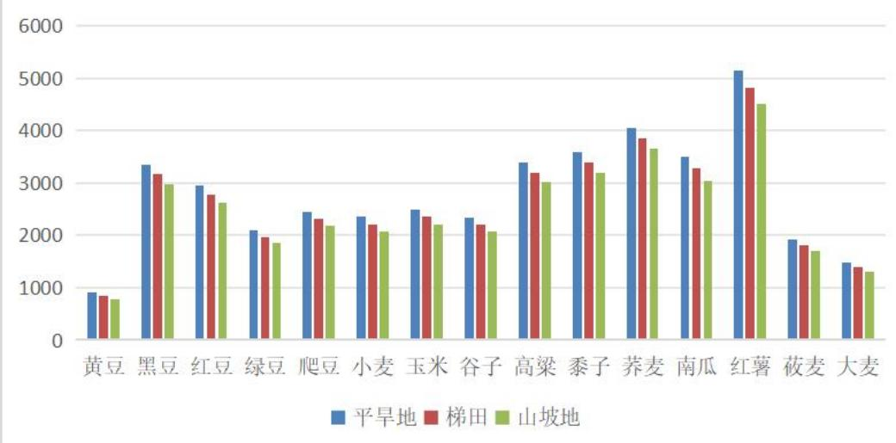{#fig:c063-profit-by-land width=90%}  
农作物的可替代性这里我们考虑两种策略：

**策略 1** 当一种农作物无法种植我们首先根据该农作物种植耕地类型上可种植作物中进行筛选，当与该作物亩利润较为接近时，我们认为其具有可替代性；

$$
L = M ( \left| d _ { _ { j 1 } } \cdot p _ { _ { j 1 } } - d _ { _ { j 2 } } \cdot p _ { _ { j 2 } } \right| )
$$

**策略 2** 当受自身种植资金的问题导致无法种植某作物，根据作物种植成本的比较，选取成本较低的农作物，我们可以找到该情况下的替代品，不至于耕地面积空着造成资源浪费。定义一个可替代性系数将我们的评判标准数学化、科学化。

其中可替代系数其中可替代系数主要考虑经济可替代性（亩产利润、种植成本）

$$
L = N ( \left| e _ { j { 1 } } - e _ { j { 2 } } \right| )
$$

作物的可替代性，可以使得在遇到某种极端的市场环境，比如说某种作物销售价格突然下降，我们可以根据可替代关系寻求该作物的替代作物进行种植，使得最终种植方案得到的利润最大化，我们通过可替代系数将两种农作物的种植面积进行相关联（即一种农作物的种植面积减小，另一种的种植面积就会得到增加）：

$$
X _ { _ j } = x _ { _ j } \cdot ( 1 + \sum _ { j = 1 } ^ { 4 1 } L _ { _ j } )
$$

### 互补性的数学描述 {#sec:c063-7-2-2}

互补性系数主要考虑生态互补和资源利用互补性，针对作物间种植可能存在互补性来相互影响增加最终收益，针对互补性我们也做了两种策略：

**策略 1** 是当季混种，该策略针对的作物的利用资源和空间存在差异，在同一地块间进行混合种植可能影响双方的产量；

$$
H = h \cdot f
$$

下面简单利用作物的高度对策略一进行解释：

| **作物小麦 种类** | **玉米** | **谷子** | **高粱** | **南瓜** | **荞麦** |
| :---: | :---: | :---: | :---: | :---: | :---: |
| 高度 0.8-1 (m) | 1.8-2.5 | 1-1.2 | 2-3 | 0.1-0.3 | 0.3-0.6 |

: 作物高度示例 {#tbl:c063-006}

**策略 2** 即为作物的间作轮作策略，针对实际情况和题中着重强调的豆类作物根菌具有肥沃土壤的功效有利于其他作物的生长。

$$
H = w \cdot d _ { j } ^ { t } \cdot p _ { j } ^ { t }
$$

由于种植豆类不仅仅是为了使土壤肥沃，同时也要考虑种植豆类的经济效益，根据豆类的亩产利润对作物的互补性进行数学化、可视化处理。下面针对普通大棚第一季、水浇地第一季和智慧大棚第一、二季所能种植的豆类进行互补性进行数据

| **亩产利润** | **水浇地** | **普通大棚第一季** | **智慧大棚** |
| :---: | :---: | :---: | :---: |
| 豇豆 | 22000 | 26400 | 28080 |
| 刀豆 | 12500 | 15000 | 16500 |
| 芸豆 | 17500 | 21000 | 22320 |
| 土豆 | 5500 | 6600 | 7260 |

: 豆类作物亩产利润 {#tbl:c063-007}

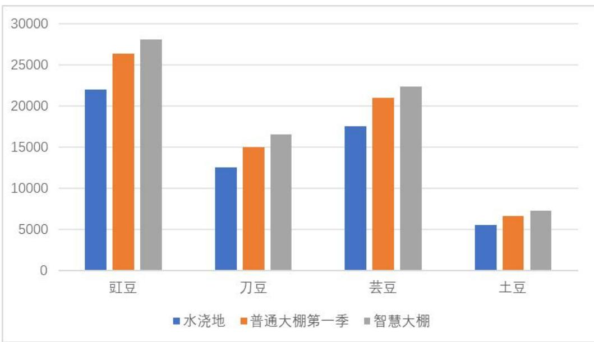{#fig:c063-complementarity-profit width=90%}

农作物种植的互补性，可以简单理解为两种农作物之间存在一个互补系数。当两种作物互补系数达到阈值，则认为该两种作物之间互补性的存在，所以会可以相互提高农作物的亩产量，下面我们对亩产量进行一个修正：

$$
D _ { i } = d \cdot ( 1 + H )
$$

## 预期销售量、销售价格与销售成本相关性分析 {#sec:c063-7-3}

**接下来分析预期销售量与销售价格种植成本之间的相关性**

根据经济学，我们可以知道销售价格与销售量呈负相关（销售价格越高，导致消费者需求降低及销售量降低）。种植成本和销售价格之间存在正相关的关系，某农作物的种植成本越高则会促使农民需求最高的销售价格来覆盖成本来取得利润。

**最终确定，**预期销售量与销售价格，种植成本之间的关系函数:

$$
Y = \beta _ { 0 } + \beta _ { 1 } \cdot X _ { 1 } + \beta _ { 2 } \cdot X _ { 2 } + \beta _ { 3 } \cdot X _ { 3 } + \varepsilon
$$

其中Y 代表预期销售量（或者其他因变量，如销售收入）。

X1 代表销售价格。

X2 代表种植成本。

β0 是截距项，表示当所有解释变量为零时的预期销售量的基线值。

β1 是销售价格的系数，表示销售价格每变化一个单位，预期销售量平均变化的单位数。

β2 是种植成本的系数，表示种植成本每变化一个单位，预期销售量平均变化的单位数。

β3 可以代表其他控制变量的系数，例如作物类型、季节性因素等。

$\varepsilon$是误差项，表示模型未能捕捉到的随机波动。

通过预期销售量、销售价格和种植成本之间的相关性，对这三个不确定性因素进行相关联，设定相应参数是其中一项的变化会对另外两项的造成一定程度的影响

## 可替代、互补性种植决策方案优化模型 {#sec:c063-7-4}

根据前面多种约束条件和不确定性因素的参数调整，综合考虑各种作弄五中纸质件的可能存在的替代性将各种农作物的种植面积（引申至作物的最终产量）之间添加关联性系数，进而使得某几种作物将不会大大影响最终种植方案得到的最大利润，即赠加了模型的稳定性；各种作物种植中存在的互补性直接会影响我们种植农作物的亩产量进而增加收入，同时经过文献的查阅农作物之间还存在着混种的种植方式充分结合作物的资源需求、空间需求的差异的互补来充分利用可种植耕地增加产量。

最终结合上面各种参数修正得到农作物替代、互补性种植方案优化模型

**①超过部分滞销造成浪费：**

$$
W=\sum_{t}\sum_{j=1}^{41}\sum_{i=1}^{54}
\left[
p_{ij}\cdot\min(D_j,\mathit{pre}_j^t)
-e_{ij}^t\cdot X_j
\right]
$$

$$
\mathrm{st.}\quad
\left\{
\begin{gathered}
\textstyle\sum_{j=0}^{41} x_{ij}^{t} \le a_i
\\[4pt]
\textstyle\sum_{j=0}^{41} y_{ij}^{t} \le a_i
\\[4pt]
F(x_{ij}^{t})+F(x_{ij}^{t+1}) \le 1 \qquad j \le 15
\\[4pt]
F(x_{ij}^{t})+F(x_{ij}^{t+1}) \le 1
\\[4pt]
x_{ij}^{t}+x_{ij}^{t+1} \le a_i
\\[4pt]
\textstyle\sum_{j=1}^{5}\left(x_{ij}^{t}+x_{ij}^{t+1}+x_{ij}^{t+2}\right) \ge a_i
\\[4pt]
\textstyle\sum_{j=17}^{19}\left(x_{ij}^{t}+y_{ij}^{t}+x_{ij}^{t+1}+y_{ij}^{t+1}+x_{ij}^{t+2}+y_{ij}^{t+2}\right) \ge a_i
\\[4pt]
\textstyle\sum_{i} F_{ij}^{k} \le d_j
\\[4pt]
\textstyle\sum_{i} G_{ij}^{k} \le d_j
\\[4pt]
x_{ij}^{t} \ge \alpha_i \cdot a_i
\\[4pt]
y_{ij}^{t} \ge \alpha_i \cdot a_i
\end{gathered}
\right.
$$

**②超过部分滞销，按 2023 年的销售价格 50%出售：**

$$
W=\sum_{t}\sum_{j=1}^{41}\sum_{i=1}^{54}
\left[
p_{ij}\cdot\min(D_j,\mathit{pre}_j^t)
+\frac{1}{2}\max(0,D_j-\mathit{pre}_j^t)
-e_{ij}^t\cdot X_j
\right]
$$

$$
\mathrm{st.}\quad
\left\{
\begin{gathered}
\textstyle\sum_{j=0}^{41} x_{ij}^{t} \le a_i
\\[4pt]
\textstyle\sum_{j=0}^{41} y_{ij}^{t} \le a_i
\\[4pt]
F(x_{ij}^{t})+F(x_{ij}^{t+1}) \le 1 \qquad j \le 15
\\[4pt]
F(x_{ij}^{t})+F(x_{ij}^{t+1}) \le 1
\\[4pt]
x_{ij}^{t}+x_{ij}^{t+1} \le a_i
\\[4pt]
\textstyle\sum_{j=1}^{5}\left(x_{ij}^{t}+x_{ij}^{t+1}+x_{ij}^{t+2}\right) \ge a_i
\\[4pt]
\textstyle\sum_{j=17}^{19}\left(x_{ij}^{t}+y_{ij}^{t}+x_{ij}^{t+1}+y_{ij}^{t+1}+x_{ij}^{t+2}+y_{ij}^{t+2}\right) \ge a_i
\\[4pt]
\textstyle\sum_{i} F_{ij}^{k} \le d_j
\\[4pt]
\textstyle\sum_{i} G_{ij}^{k} \le d_j
\\[4pt]
x_{ij}^{t} \ge \alpha_i \cdot a_i
\\[4pt]
y_{ij}^{t} \ge \alpha_i \cdot a_i
\end{gathered}
\right.
$$

## 模型分析与求解 {#sec:model-3-solution}
|  | **可替代性** | **互补性** | **预期销售量** | **优化效益(万元)** |
| :---: | :---: | :---: | :---: | :---: |
| 问题 2 结果 | 无 | 无 | 无 | 6024.45 |
| 情形1 | 替代策略1 | 互补策略1 | 预测销量模型1 | 6524.48 |
| 情形2 | 替代策略2 | 互补策略1 | 预测销量模型2 | 5988.62 |
| 情形3 | 替代策略1 | 互补策略2 | 预测销量模型2 | 6333.15 |
| 情形4 | 替代策略2 | 互补策略2 | 预测销量模型1 | 6269.33 |

: 问题三模型方案比较 {#tbl:c063-008}

<!-- C063-STABLE-SECTION-09 -->
# 参考文献 {#sec:references}

[1]潘思宇,姚有利,寇杰,等.基于风险评估的我国煤矿安责险费率厘定研究[J].煤,2024,33(09):19-24.

[2]邢观华.基于二维云模型和 ALARP 准则的风险评价法[J].特种结构,2024,41(04):94-100.DOI:10.19786/j.tzjg.2024.04.016.

[3]张劼超,张叶祥,杨有宏,等.基于组合赋权二维云模型的公路工程施工安全风险量化分析[J/OL].河南科学,1-9[2024-09-08].<http://124.223.140.189:8085/kcms/detail/41.1084.N.20240819.0901.004.html>.

[4]陆超,都海波.基于铁塔模型和双向天牛须的改进 RRT 轨迹规划方法[J/OL].控制与 决策,1-9[2024-09-08].<https://doi.org/10.13195/j.kzyjc.2024.0349>.

[5]李佳荣,梅华平,罗丹言,等.基于数学规划模型的生产企业原材料的订购与运输[J].黑龙江科学,2024,15(16):77-81.

<!-- C063-STABLE-SECTION-10 -->
# 附录 {#sec:appendix}

## 代码部分 {#sec:appendix-code}

> 以下代码仅保留为论文附录文本，不声明可运行，也不得执行。原机器绝对路径已为私有外发而脱敏。

### 随机状态参数生成

```matlab
%生成1000 组状态对应的参数
clc
clear
K=1000;
A=zeros(K,4);
for i=1:K
salesvolume1=unifrnd(5,10);
salesvolume2=unifrnd(-5,5);
outp=unifrnd(-10,10);
salesprice=unifrnd(-5,-1);
A(i,:)=[salesvolume1,salesvolume2,outp,salesprice]/100;
end
```

### 不同状态下收益计算

```matlab
clc
clear
%读取种植方案中的7 年数据
FangAn=cell(1,7);
FangAn{1}=xlsread('<REDACTED-PRIVATE-PATH>','sheet1','C2:AQ109');
FangAn{2}=xlsread('<REDACTED-PRIVATE-PATH>','sheet2','C2:AQ109');
FangAn{3}=xlsread('<REDACTED-PRIVATE-PATH>','sheet3','C2:AQ109');
FangAn{4}=xlsread('<REDACTED-PRIVATE-PATH>','sheet4','C2:AQ109');
FangAn{5}=xlsread('<REDACTED-PRIVATE-PATH>','sheet5','C2:AQ109');
FangAn{6}=xlsread('<REDACTED-PRIVATE-PATH>','sheet6','C2:AQ109');
FangAn{7}=xlsread('<REDACTED-PRIVATE-PATH>','sheet7','C2:AQ109');
%读取利润相关数据
RandomG=xlsread('<REDACTED-PRIVATE-PATH>'); %生成的随机数
PerOut=xlsread('<REDACTED-PRIVATE-PATH>','Sheet2','C2:AQ109'); %亩产量
Cost=xlsread('<REDACTED-PRIVATE-PATH>','Sheet3','C2:AQ109'); %种植成本
ExpSale1=xlsread('<REDACTED-PRIVATE-PATH>','Sheet5','C2:C42'); %第一季预期销售量
ExpSale2=xlsread('<REDACTED-PRIVATE-PATH>','Sheet5','D2:D42'); %第二季预期销售量
Price1=xlsread('<REDACTED-PRIVATE-PATH>','Sheet5','E2:E42'); %第一季预期价格
Price2=xlsread('<REDACTED-PRIVATE-PATH>','Sheet5','F2:F42'); %第二季预期价格
%求出各年份的收益
H=size(RandomG,1);
ProMat=zeros(H,8);
for i=1:H
rg=RandomG(i,:); %取出第 i 组随机数,4 维行向量，小麦/玉米预期销售量，其他
物预期销售量，亩产量，食用菌销售价格
for j=1:7
%更新各年份的相关数据
NewExpSale1=ExpSale1*(1+rg(2)); %预期销售量
NewExpSale1([6,7])=ExpSale1([6,7])*(1+rg(1))^j;
NewExpSale2=ExpSale2*(1+rg(2));
NewExpSale2([6,7])=ExpSale2([6,7])*(1+rg(1))^j;
NewPerOut=PerOut*(1+rg(3)); %亩产量
NewCost=Cost*(1+0.05)^j; %种植成本，不同地块，不同作物
NewPrice1=Price1; %销售价格
NewPrice1([17:37])=Price1([17:37])*(1+0.05)^j;
NewPrice1([38:40])=Price1([38:40])*(1+rg(4))^j;
NewPrice1(41)=Price1(41)*(1-0.05)^j;
NewPrice2=Price2;
NewPrice2([17:37])=Price2([17:37])*(1+0.05)^j;
NewPrice2([38:40])=Price2([38:40])*(1+rg(4))^j;
NewPrice2(41)=Price2(41)*(1-0.05)^j;
output=FangAn{j}.*NewPerOut; %不同地块不同作物的产量
CropsOutput=[sum(output(1:54,:),1),sum(output(55:108,:),1)]'; %不同作物的产
量，对地块求和
SalesV=(SalesQ+(1/2)\*max(0,CropsOutput-  
NewExpSale)).\*[NewPrice1;NewPrice2]; %不同作物的销售额
CostIJ=FangAn{j}.*NewCost; %不同地块不同作物的种植成本
CostJ=[sum(CostIJ(1:54,:),1),sum(CostIJ(55:108,:),1)]'; %不同作物的种植成本
Profit=sum(SalesV-CostJ); %收益
ProMat(i,j)=Profit;
end
end
```

### LINGO 优化模型

```text
Model:   
!CUMCM2024Cpro1;!2024;   
sets:   
Lots/L1..L54/:a,r;   
Crops/C1..C41/:e,ee,M,MM,P,PP;   
Years/Y1..Y3/:Prof;   
links1(Lots,Crops):U,V,C,CC,S,SS,X1,X2,X3,X4,X5,X6,X7,Y1,Y2,Y3,Y4,Y5,Y6,Y7;   
links2(Lots,Crops,Years):X,Y,F,G;   
links3(Crops,Years):SU,SV;   
endsets   
data:   
a=@ole('<REDACTED-PRIVATE-PATH>','sheet1!C2:C55');   
r=@ole('<REDACTED-PRIVATE-PATH>','sheet1!D2:D55');   
U=@ole('<REDACTED-PRIVATE-PATH>','sheet2!C2:AQ55');   
V=@ole('<REDACTED-PRIVATE-PATH>','sheet2!C56:AQ109');   
C=@ole('<REDACTED-PRIVATE-PATH>','sheet3!C2:AQ55');   
CC=@ole('<REDACTED-PRIVATE-PATH>','sheet3!C56:AQ109');   
S=@ole('<REDACTED-PRIVATE-PATH>','sheet4!C2:AQ55');   
SS=@ole('<REDACTED-PRIVATE-PATH>','sheet4!C56:AQ109');   
M=@ole('<REDACTED-PRIVATE-PATH>','sheet5!C2:C42');   
MM=@ole('<REDACTED-PRIVATE-PATH>','sheet5!D2:D42');   
P=@ole('<REDACTED-PRIVATE-PATH>','sheet5!E2:E42');   
PP=@ole('<REDACTED-PRIVATE-PATH>','sheet5!F2:F42');   
e=@ole('<REDACTED-PRIVATE-PATH>','sheet5!G2:G42');   
ee=@ole('<REDACTED-PRIVATE-PATH>','sheet5!H2:H42');   
@ole('<REDACTED-PRIVATE-PATH>','sheet1!C2:AQ55')=X1;   
@ole('<REDACTED-PRIVATE-PATH>','sheet1!C56:AQ109')=Y1;   
@ole('<REDACTED-PRIVATE-PATH>','sheet2!C2:AQ55')=X2;
@ole('<REDACTED-PRIVATE-PATH>','sheet2!C56:AQ109')=Y2;
@ole('<REDACTED-PRIVATE-PATH>','sheet3!C2:AQ55')=X3;
@ole('<REDACTED-PRIVATE-PATH>','sheet3!C56:AQ109')=Y3;
@ole('<REDACTED-PRIVATE-PATH>','sheet4!C2:AQ55')=X4;
@ole('<REDACTED-PRIVATE-PATH>','sheet4!C56:AQ109')=Y4;
@ole('<REDACTED-PRIVATE-PATH>','sheet5!C2:AQ55')=X5;
@ole('<REDACTED-PRIVATE-PATH>','sheet5!C56:AQ109')=Y5;
@ole('<REDACTED-PRIVATE-PATH>','sheet6!C2:AQ55')=X6;
@ole('<REDACTED-PRIVATE-PATH>','sheet6!C56:AQ109')=Y6;
@ole('<REDACTED-PRIVATE-PATH>','sheet7!C2:AQ55')=X7;
@ole('<REDACTED-PRIVATE-PATH>','sheet7!C56:AQ109')=Y7;
enddata
max=@sum(Crops(j):@sum(Years(k)|k#GE#2:@SMIN(SU(j,k),M(j))*P(j)+@SMIN(SV(j,k),
MM(j))*PP(j)
-@sum(Lots(i):X(i,j,k)*C(i,j)-Y(i,j,k)*CC(i,j))));
@for(links3(j,k):
SU(j,k)=@sum(Lots(i):X(i,j,k)*U(i,j));
SV(j,k)=@sum(Lots(i):Y(i,j,k)*V(i,j));
);
@for(links2(i,j,k):
X(i,j,k)>=0.01*F(i,j,k);
X(i,j,k)<=100*F(i,j,k);
Y(i,j,k)>=0.01*G(i,j,k);
Y(i,j,k)<=100*G(i,j,k);
);
@for(Lots(i):
@for(Years(k):
@sum(Crops(j):X(i,j,k))<=a(i);
@sum(Crops(j):Y(i,j,k))<=a(i);
);
);
@for(links2(i,j,k)|i#LE#26:
Y(i,j,k)=0;
);
@for(links2(i,j,k)|i#LE#26#and#j#GE#16#and#j#LE#41:
X(i,j,k)=0;
);
@for(links2(i,j,k)|i#GE#27#and#i#LE#34#and#j#EQ#16:
Y(i,j,k)=0;
);
@for(links2(i,j,k)|i#GE#27#and#i#LE#34#and#j#LE#15:
X(i,j,k)=0;
);
@for(links2(i,j,k)|i#GE#27#and#i#LE#34#and#j#GE#35#and#j#LE#41:
X(i,j,k)=0;
);
@for(links2(i,j,k)|i#GE#27#and#i#LE#34#and#j#LE#34:
Y(i,j,k)=0;
);
@for(links2(i,j,k)|i#GE#27#and#i#LE#34#and#j#GE#38#and#j#LE#41:
Y(i,j,k)=0;
);
@for(links2(i,j,k)|i#GE#35#and#i#LE#50#and#j#LE#16:
X(i,j,k)=0;
);
@for(links2(i,j,k)|i#GE#35#and#i#LE#50#and#j#GE#35#and#j#LE#41:
X(i,j,k)=0;
);
@for(links2(i,j,k)|i#GE#35#and#i#LE#50#and#j#LE#37:
Y(i,j,k)=0;
);
@for(links2(i,j,k)|i#GE#51#and#i#LE#54#and#j#LE#16:
X(i,j,k)=0;
Y(i,j,k)=0;
);
@for(links2(i,j,k)|i#GE#51#and#i#LE#54#and#j#GE#35#and#j#LE#41:
X(i,j,k)=0;
Y(i,j,k)=0;
);
@for(links1(i,j):
X(i,j,1)=S(i,j);
Y(i,j,1)=SS(i,j);
);
@for(Years(k)|k#LE#2:
@for(links1(i,j)|i#LE#26:
!f(i,j,k)+f(i,j,k+1)<=1;
X(i,j,k)+X(i,j,k+1)<=a(i);
);   
);   
@for(Years(k)|k#LE#2:   
@for(links1(i,j)|i#GE#27#and#i#LE#34#and#j#EQ#16:   
!f(i,j,k)+f(i,j,k+1)<=1;   
X(i,j,k)+X(i,j,k+1)<=a(i);   
);   
);   
@for(Years(k)|k#GE#2:   
@for(links1(i,j)|i#GE#27#and#i#LE#34#and#j#GE#17#and#j#LE#34:   
!f(i,j,k)+g(i,j,k)<=1;   
X(i,j,k)+Y(i,j,k)<=a(i);   
);   
);   
@for(Years(k)|k#LE#2:   
@for(links1(i,j)|i#GE#27#and#i#LE#34#and#j#GE#16#and#j#LE#34:   
!g(i,j,k)+f(i,j,k+1)<=1;   
Y(i,j,k)+X(i,j,k+1)<=a(i);   
);   
);   
@for(Years(k)|k#GE#2:   
@for(links1(i,j)|i#GE#51#and#i#LE#54#and#j#GE#17#and#j#LE#34:   
!f(i,j,k)+g(i,j,k)<=1;   
X(i,j,k)+Y(i,j,k)<=a(i);   
);   
);   
@for(Years(k)|k#LE#2:   
@for(links1(i,j)|i#GE#51#and#i#LE#54#and#j#GE#17#and#j#LE#34:   
!g(i,j,k)+f(i,j,k+1)<=1;   
Y(i,j,k)+X(i,j,k+1)<=a(i);   
);   
);   
@for(Years(k)|k#LE#1:   
@for(Lots(i)|i#LE#26:   
@sum(Crops(j)|j#LE#5:X(i,j,k)+X(i,j,k+1)+X(i,j,k+2))>=a(i);   
);   
);   
@for(Years(k)|k#LE#1:   
@for(Lots(i)|i#GE#27:   
@sum(Crops(j)|j#GE#17#and#j#LE#19:X(i,j,k)+Y(i,j,k)+X(i,j,k+1)+Y(i,j,k+1)+X(i,j,k+2)+Y(i,j,
k+2))>=a(i);   
);   
);   
@for(Years(k)|k#GE#2:   
@for(Crops(j):   
@sum(Lots(i):f(i,j,k))<=e(j);   
@sum(Lots(i):g(i,j,k))<=ee(j);   
);   
);   
@for(links2(i,j,k)|k#GE#2:   
X(i,j,k)>=r(i)\*a(i)\*F(i,j,k);   
Y(i,j,k)>=r(i)\*a(i)\*G(i,j,k);   
);   
@for(links1(i,j):   
X1(i,j)=X(i,j,2);X2(i,j)=X(i,j,3);!X3(i,j)=X(i,j,4);!X4(i,j)=X(i,j,5);!X5(i,j)=X(i,j,6);!X6(i,j)=X(i,j,7);!   
X7(i,j)=X(i,j,8);   
Y1(i,j)=Y(i,j,2);Y2(i,j)=Y(i,j,3);!Y3(i,j)=Y(i,j,4);!Y4(i,j)=Y(i,j,5);!Y5(i,j)=Y(i,j,6);!Y6(i,j)=Y(i,j,7);!   
Y7(i,j)=Y(i,j,8);   
);   
@for(Years(k):   
Prof(k)=@sum(Crops(j):@SMIN(SU(j,k),M(j))\*P(j)+@SMIN(SV(j,k),MM(j))\*PP(j)-   
@sum(Lots(i):X(i,j,k)\*C(i,j)+Y(i,j,k)\*CC(i,j)));   
);   
@for(links2:@Bin(F);@Bin(G););   
end
```

## 数据表附录 {#sec:appendix-data}

## 主要农产品单位面积产量 {#sec:appendix-output-per-hectare}

原始统计表为整页紧凑数据表。MinerU 的 HTML/OCR 已合并和错置部分单元格，无法在不猜测数据的前提下可靠重建为可编辑 Markdown；这里保留 MinerU 从原 PDF 表格区域提取的图像，以避免错误列结构进入 PDF。

| **数据表图像** |
| :---: |
| 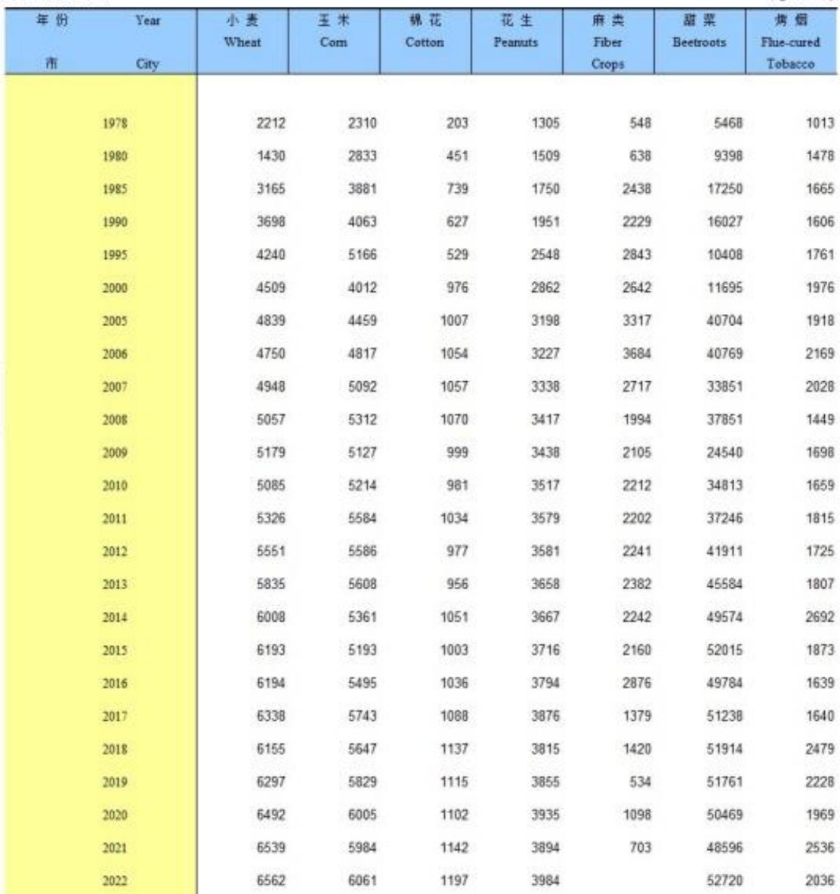{width=100%} |

: 主要农产品单位面积产量 {#tbl:c063-009}

| **数据表图像** |
| :---: |
| 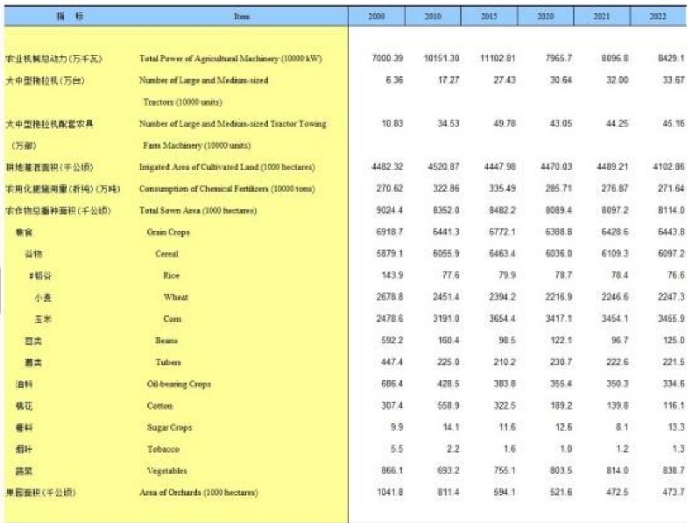{width=100%} |

: 农业生产条件与农作物播种面积 {#tbl:c063-010}

| **数据表图像** |
| :---: |
| 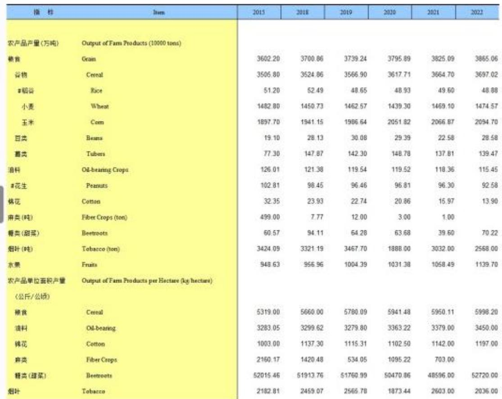{width=100%} |

: 主要农牧渔业生产情况 {#tbl:c063-011}

## 主要农作物种植结构 {#sec:appendix-planting-structure}

单位：%

| **数据表图像** |
| :---: |
| 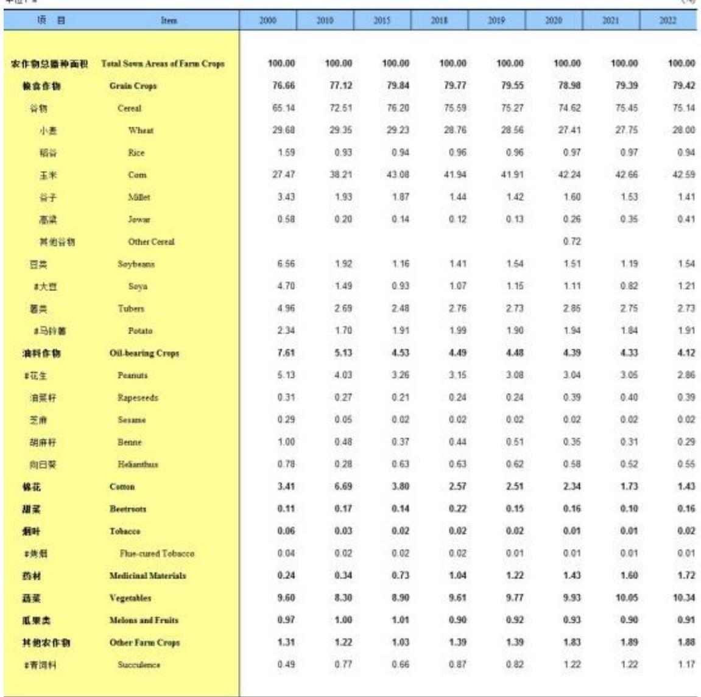{width=100%} |

: 主要农作物种植结构 {#tbl:c063-012}

\input{tables/c063-013-unit-price.tex}

\input{tables/c063-015-revenue.tex}
